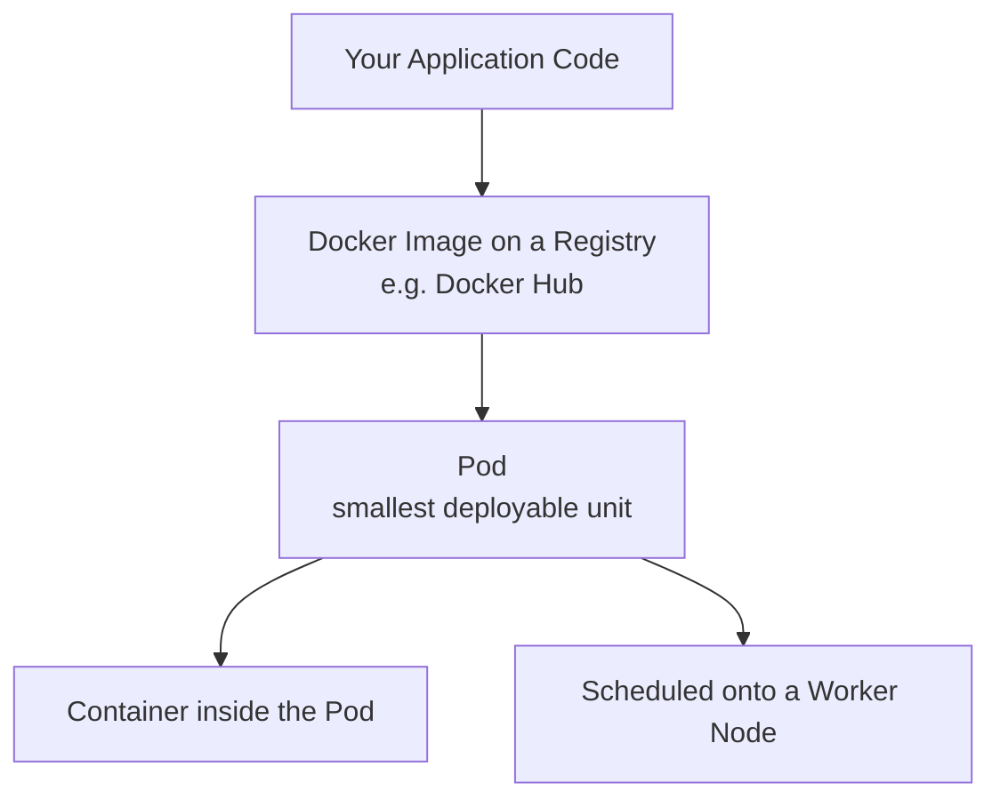
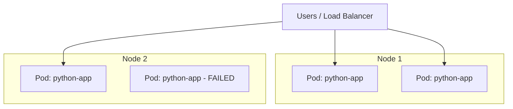
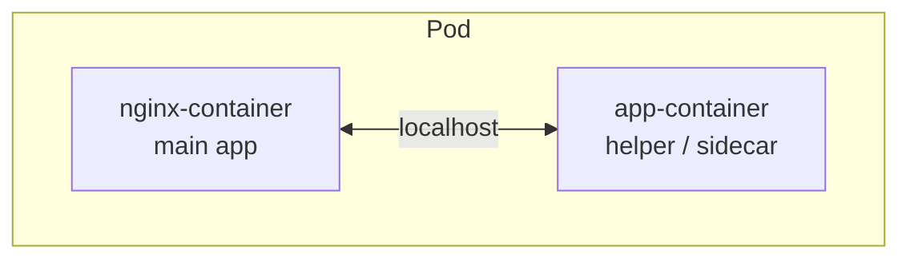
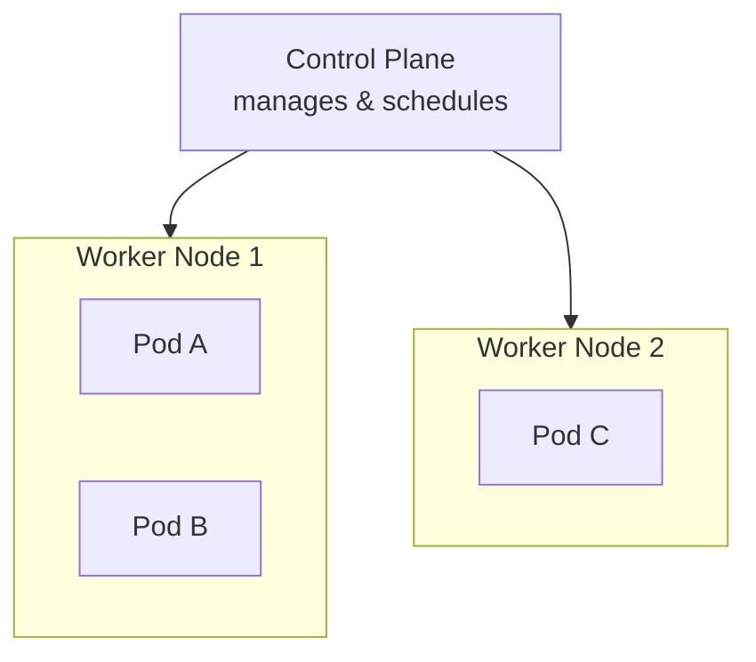
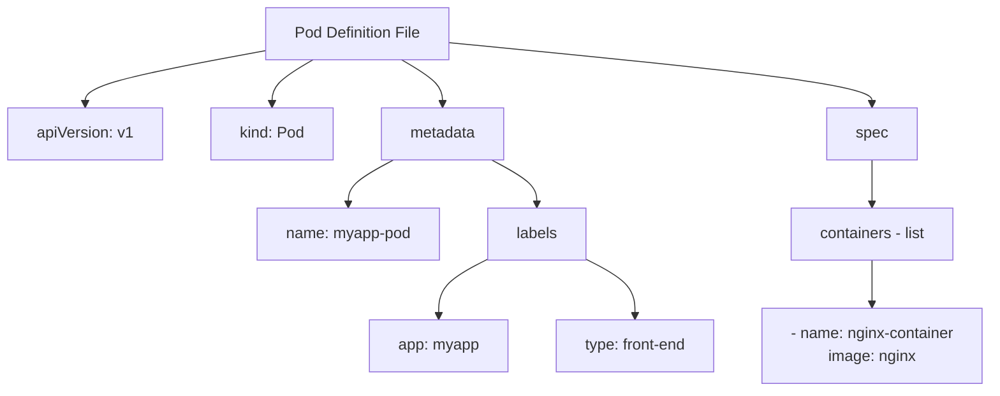
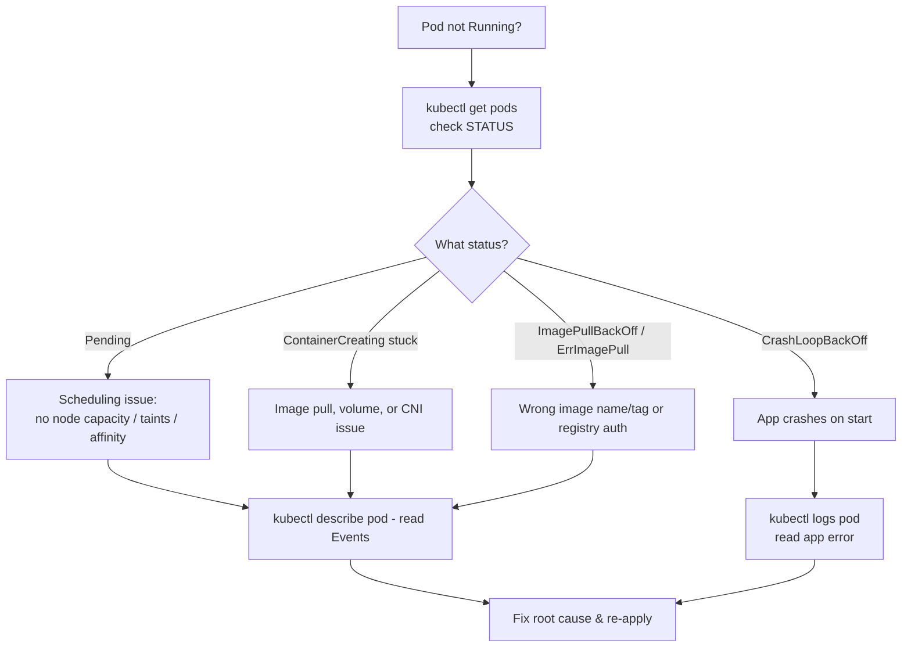

# Kubernetes Pods — The Complete Study & Interview Guide

> **Scope of this document:** Everything you need to fully understand Kubernetes Pods for the CKA exam, real-world work, and interviews. It combines the video transcript, the slide images, and the three KodeKloud reference pages (Pods, Pods with YAML, Demo Pods with YAML) into one self-contained study resource. After reading this, you should not need to go back to the original material for revision.

---

## Table of Contents

1. [What Is a Pod?](#1-what-is-a-pod)
2. [The Docker → Kubernetes Analogy](#2-the-docker--kubernetes-analogy)
3. [Why Pods Exist (Instead of Bare Containers)](#3-why-pods-exist-instead-of-bare-containers)
4. [Scaling in Kubernetes — A Critical Concept](#4-scaling-in-kubernetes--a-critical-concept)
5. [Single-Container vs Multi-Container Pods](#5-single-container-vs-multi-container-pods)
6. [Pods and Nodes](#6-pods-and-nodes)
7. [Creating Pods — The Imperative Way (`kubectl run`)](#7-creating-pods--the-imperative-way-kubectl-run)
8. [Docker vs Kubernetes Command Comparison](#8-docker-vs-kubernetes-command-comparison)
9. [Creating Pods — The Declarative Way (YAML)](#9-creating-pods--the-declarative-way-yaml)
10. [Hands-On Lab: Build a Pod from YAML](#10-hands-on-lab-build-a-pod-from-yaml)
11. [Command Reference Tables](#11-command-reference-tables)
12. [Best Practices](#12-best-practices)
13. [Common Mistakes & Misconceptions](#13-common-mistakes--misconceptions)
14. [Troubleshooting Pods](#14-troubleshooting-pods)
15. [Interview Questions (Basic → Advanced)](#15-interview-questions-basic--advanced)
16. [Final Revision Sheet](#16-final-revision-sheet)

---

## 1. What Is a Pod?

A **Pod** is the **smallest deployable unit in Kubernetes**. It represents a **single instance of an application**.

The key idea that trips up beginners: in Kubernetes, **you do not deploy containers directly onto worker nodes**. Instead, Kubernetes wraps one or more containers inside an object called a **Pod**, and it is the *Pod* that gets scheduled onto a node.



**Definition to memorize:**
> A Pod is the smallest deployable object in Kubernetes that encapsulates one or more containers, which share the same network namespace, storage volumes, and lifecycle.

### Assumptions before you deploy a Pod

The KodeKloud material assumes three things are already true before you create your first Pod:

1. Your application is **already developed** and **built into a Docker image**.
2. That image is **hosted on a Docker repository** (such as Docker Hub) so the cluster can pull it.
3. Your **Kubernetes cluster is already configured and running** (single-node or multi-node).

> 💡 **Mental model:** Kubernetes' whole job is to run your containers on worker nodes. The Pod is simply the "envelope" it uses to do that.

---

## 2. The Docker → Kubernetes Analogy

The easiest way to understand Pods is to compare them to what you already do in Docker.

- When you **install Docker** for the first time, the first thing you naturally do is run a container: `docker run nginx`.
- When you **configure a Kubernetes cluster** for the first time, the first thing you naturally do is create a Pod: `kubectl run nginx --image=nginx`.

The *workflow* is nearly identical — you're just working one abstraction level higher.

| Concept | Docker | Kubernetes |
|--------|--------|-----------|
| Smallest thing you create | **Container** | **Pod** |
| First command you'd run | `docker run nginx` | `kubectl run nginx --image=nginx` |
| What it wraps | The app process | One or more containers |

> 💡 **Key takeaway:** If your Docker container fundamentals are solid, Pods become far easier — a Pod is essentially a managed wrapper around containers with extra superpowers (shared networking, shared storage, shared lifecycle).

---

## 3. Why Pods Exist (Instead of Bare Containers)

If a Pod usually just holds one container, why not deploy the container directly? This is one of the **most common interview questions**, so understand it deeply.

Imagine you deploy your app the raw Docker way:

```bash
docker run python-app
```

Load increases, so you manually start more instances:

```bash
docker run python-app
docker run python-app
docker run python-app
```

Now suppose each app instance needs a **helper container** (for log shipping, file uploads, data processing, etc.). In raw Docker you'd have to wire everything up manually:

```bash
docker run helper --link app1
docker run helper --link app2
docker run helper --link app3
```

You'd be personally responsible for:
- Building custom networks / links between each app and its helper.
- Creating and attaching shared volumes.
- Making sure a helper starts and stops together with its app.
- Cleaning all of this up when instances die.

This becomes fragile and unmanageable at scale.

**The Pod solves all of this automatically.** When you define containers inside a Pod, Kubernetes guarantees they:
- **Share the same network namespace** → they talk to each other over `localhost`.
- **Share storage volumes** → they can read/write the same files.
- **Share lifecycle events** → they are created together and destroyed together.

```mermaid
graph LR
    subgraph "Raw Docker — manual & fragile"
        A1[app1] -.--link.-> H1[helper1]
        A2[app2] -.--link.-> H2[helper2]
        A3[app3] -.--link.-> H3[helper3]
    end
    subgraph "Kubernetes Pod — automatic"
        P[Pod: app + helper<br/>shared network, storage, lifecycle]
    end
```

> 💡 **Interview-ready one-liner:** "Pods give containers a shared context — networking, storage, and lifecycle — so tightly-coupled containers can be managed as a single unit instead of being wired together by hand."

> ⚠️ **Note:** Even when your app is a single container, Kubernetes still forces the Pod abstraction. This is deliberate — it future-proofs your app for scaling and for adding helper containers later without redesigning anything.

---

## 4. Scaling in Kubernetes — A Critical Concept

This is the single most misunderstood point about Pods, and a frequent interview trap.

**When load increases, you scale by adding more Pods — NOT by adding more containers to an existing Pod.**

- ✅ **Correct:** Run two, three, or ten identical Pods, each a separate instance of the app. Kubernetes can spread them across nodes.
- ❌ **Wrong:** Cram more copies of the same container into a single Pod.



If demand grows beyond the current node's capacity, Kubernetes schedules the new Pods onto **other nodes** in the cluster. If the cluster is out of capacity, you add more nodes, then more Pods.

> 💡 **Memorize this sentence:** *Scaling up = more Pods. Scaling down = fewer Pods. The number of containers inside a Pod is a design decision, not a scaling lever.*

---

## 5. Single-Container vs Multi-Container Pods

### Single-container Pods (the common case)

Most Pods run **exactly one container** — your main application. This is what you'll use 90%+ of the time, and it's the focus of the core lessons.

### Multi-container Pods (the special case)

A Pod **can** hold multiple containers, but they should be **complementary, not redundant**. You do *not* put two copies of the same app in one Pod. Instead you put a main container plus a **helper (sidecar)** container that supports it.

Typical helper/sidecar jobs: log shipping, file syncing, data processing, a proxy, etc.



Because they live in the same Pod, the two containers:
- **Communicate over `localhost`** (same network namespace) — no service discovery needed between them.
- **Share storage volumes** — one writes a file, the other reads it.
- **Share the lifecycle** — they start together and stop together.

| Aspect | Single-Container Pod | Multi-Container Pod |
|--------|---------------------|---------------------|
| Number of containers | 1 | 2 or more |
| Purpose of extra container | N/A | Helper / sidecar (complementary) |
| Communication | With outside world via Service | Internally via `localhost` |
| Frequency of use | Very common | Less common |
| Redundant copies allowed? | — | ❌ No — that's what extra Pods are for |

> ⚠️ **Misconception alert:** "Add more containers to a Pod to handle more traffic." Wrong. More traffic → more **Pods**. Multiple containers in one Pod = a main app + its helper(s), and those containers always live and die together.

---

## 6. Pods and Nodes

A Pod must run *somewhere*. That "somewhere" is a **Node**.

### The four points to note (from the slides)

1. **A Pod always runs on a Node.** A Pod is essentially a container, and every container needs a machine to run on.
2. **A Node is a worker machine in Kubernetes.** It's where actual workloads (Pods) execute.
3. **Each Node is managed by the Kubernetes Control Plane.** The control plane decides scheduling, monitors health, and reconciles state.
4. **A Node can host multiple Pods** simultaneously.



> ⚠️ **Best practice:** Technically a Pod *can* be scheduled on the control-plane node (depending on taints/config), but in production this is **not recommended**. Application Pods should run on dedicated **worker nodes**; the control plane should stay reserved for cluster management.

> 📝 **Minikube note:** On Minikube you often see only the control-plane node and no separate worker node, because Minikube runs everything on a single machine. That's expected in a learning setup.

---

## 7. Creating Pods — The Imperative Way (`kubectl run`)

The fastest way to launch a Pod is the **imperative** command `kubectl run`. "Imperative" means you tell Kubernetes exactly *what to do, right now*, via a command.

```bash
kubectl run nginx --image=nginx
```

**Breaking it down:**

| Part | Meaning |
|------|---------|
| `kubectl run` | Create and run a new Pod |
| `nginx` | The **name** you're giving the Pod |
| `--image=nginx` | The **Docker image** to pull and run (from Docker Hub by default) |

- **What it does:** Creates a Pod named `nginx` that runs one container from the `nginx` image.
- **When to use it:** Quick tests, exam speed, throwaway Pods, or generating YAML (see best practices).
- **Expected result:** A new Pod appears and moves from `ContainerCreating` → `Running`.

### Verifying the Pod

```bash
kubectl get pods
```

Right after creation you may see the container still being set up:

```text
NAME    READY   STATUS              RESTARTS   AGE
nginx   0/1     ContainerCreating   0          7s
```

A few seconds later, once the image is pulled and the container starts:

```text
NAME    READY   STATUS    RESTARTS   AGE
nginx   1/1     Running   0          9s
```

**Reading this output:**
- `READY 1/1` → 1 of 1 containers in the Pod are ready.
- `STATUS Running` → the Pod is up.
- `RESTARTS 0` → the container hasn't crashed/restarted.
- `AGE` → how long since it was created.

> ⚠️ **Important:** After `kubectl run nginx`, the nginx web server is **only reachable inside the cluster/node**. External users cannot hit it yet — you need Kubernetes **Services** and networking (a later topic) to expose it.

---

## 8. Docker vs Kubernetes Command Comparison

Almost every day-one Docker command has a `kubectl` equivalent. Learn these as pairs.

| Purpose | Docker Command | Kubernetes Command |
|---------|---------------|--------------------|
| Create & run | `docker run nginx` | `kubectl run nginx --image=nginx` |
| List running | `docker ps` | `kubectl get pods` |
| View logs | `docker logs <container>` | `kubectl logs <pod>` |
| Get detailed info | `docker inspect <container>` | `kubectl describe pod <pod-name>` |
| Interactive shell | `docker exec -it <container> bash` | `kubectl exec -it <pod-name> -- bash` |
| Remove | `docker rm <container>` | `kubectl delete pod <pod-name>` |

### Each command explained

**`kubectl get pods`** — lists all Pods and their status.
```bash
kubectl get pods
```
Add `-o wide` for extra columns (Pod IP, the node it's on, etc.):
```bash
kubectl get pods -o wide
```
> 📝 The IP shown in `-o wide` is the **Pod IP**, *not* the worker node's IP. Each Pod gets its own IP inside the cluster network.

**`kubectl logs <pod>`** — prints the logs from the container in the Pod. Your first stop when an app misbehaves.
```bash
kubectl logs nginx
```

**`kubectl describe pod <pod-name>`** — the deep-dive command. Shows Pod IP, the node it landed on, container details, conditions, mounted volumes, and — most usefully — the **Events** timeline (scheduling, image pulling, container start).
```bash
kubectl describe pod nginx
```
> 💡 The **Events** section at the bottom is gold for troubleshooting — it tells you *why* a Pod is stuck.

**`kubectl exec -it <pod-name> -- bash`** — opens an interactive shell inside the running container (if the image ships a shell like bash).
```bash
kubectl exec -it nginx -- bash
```
- `-i` = interactive (keep stdin open), `-t` = allocate a TTY.
- The `--` separates kubectl's own flags from the command you want to run inside the container.
- **Exit** the shell with `Ctrl + D` (or type `exit`).

**`kubectl delete pod <pod-name>`** — deletes the Pod. You can delete several at once by listing names.
```bash
kubectl delete pod nginx
kubectl delete pod nginx-01 nginx-02
```
Verify it's gone:
```bash
kubectl get pods
```

> ⚠️ **Docker vs Kubernetes exec syntax difference:** Docker uses `docker exec -it <container> bash`. Kubernetes needs the `--` separator: `kubectl exec -it <pod> -- bash`. Forgetting the `--` is a very common mistake.

---

## 9. Creating Pods — The Declarative Way (YAML)

The imperative `kubectl run` is fast, but real-world and production Kubernetes is **declarative**: you write a **YAML definition file** that describes the *desired state*, and Kubernetes makes reality match it. YAML files can be version-controlled, reviewed, and reused — which is why they're the professional standard.

### The 4 top-level (root) fields — every Kubernetes object has these

Every Kubernetes definition file — Pod, ReplicaSet, Deployment, Service — shares the **same four root fields**:

```yaml
apiVersion:
kind:
metadata:
spec:
```

| Field | What it means | Value for a Pod |
|-------|--------------|-----------------|
| `apiVersion` | Version of the Kubernetes API you're using | `v1` |
| `kind` | The type of object you're creating (case-sensitive) | `Pod` |
| `metadata` | Data *about* the object — name and labels (a dictionary) | name + labels |
| `spec` | The actual specification / desired config of the object | container list |

**`apiVersion` cheat sheet** (you'll meet these later):

| Object | apiVersion |
|--------|-----------|
| Pod | `v1` |
| Service | `v1` |
| ReplicaSet | `apps/v1` |
| Deployment | `apps/v1` |

### A complete Pod YAML

```yaml
apiVersion: v1
kind: Pod
metadata:
  name: myapp-pod
  labels:
    app: myapp
    type: front-end
spec:
  containers:
    - name: nginx-container
      image: nginx
```

### Understanding each section

**`metadata`** is a **dictionary**. It holds the Pod's `name` and optional `labels`.
- **Labels** are arbitrary key–value pairs (`app: myapp`, `type: front-end`) used later to group and select objects. You can invent any labels you want.
- ⚠️ **Indentation rule:** sibling keys must sit at the *same* indentation level. `name` and `labels` are siblings, so they align. Misaligned siblings = parse error.

**`spec`** holds the real configuration. For a Pod, the important child is `containers`, which is a **list (array)** — because a Pod can have more than one container.
- The dash (`-`) marks a **list item**.
- Each container needs at least a `name` and an `image`.
- To add a second container, add another `- name: ... / image: ...` block under `containers`.



### YAML rules that save you pain

- Use **2 spaces per indentation level**. **Never use tabs** — YAML rejects tabs.
- Keys are **case-sensitive**: `Pod` ✅, `pod` ❌.
- Siblings must align exactly; children indent one level deeper than their parent.

> 💡 **Dictionary vs List:** `metadata` is a *dictionary* (unordered key: value pairs). `containers` is a *list* (ordered, each item starts with `-`). Knowing which is which is the key to reading any Kubernetes YAML.

### Creating the Pod from the file

You have two commands — both work for creating from a file:

```bash
kubectl create -f pod-definition.yaml
# or
kubectl apply -f pod-definition.yaml
```

`-f` means "**from this file**". Expected output with `apply`:
```text
pod/nginx created
```

> 💡 **`create` vs `apply` (quick preview):** `create` fails if the object already exists. `apply` creates it if missing and updates it if it already exists — which is why `apply` is the go-to for the declarative workflow. (Full imperative-vs-declarative discussion comes in a later lesson.)

### Verifying and inspecting

```bash
kubectl get pods
```
```text
NAME         READY   STATUS    RESTARTS   AGE
myapp-pod    1/1     Running   0          20s
```

```bash
kubectl describe pod myapp-pod
```
This returns metadata, the **Node** it was scheduled to, the **Pod IP**, container details, **Conditions** (`Initialized`, `Ready`, `ContainersReady`, `PodScheduled`), mounted volumes, and the **Events** timeline (`Scheduled → Pulling → Pulled → Created → Started`).

---

## 10. Hands-On Lab: Build a Pod from YAML

A mini end-to-end lab mirroring the KodeKloud demo. Do this in Minikube, Killercoda, or any cluster.

### Step 1 — Create the file

```bash
vim pod.yaml
```
Paste:
```yaml
apiVersion: v1
kind: Pod
metadata:
  name: nginx
  labels:
    app: nginx
    tier: frontend
spec:
  containers:
    - name: nginx
      image: nginx
```

### Step 2 — Save & verify the file

In vim, save and quit with `:wq`, then confirm the contents:
```bash
cat pod.yaml
```
**Expected:** the YAML you just wrote is printed back.

### Step 3 — Create the Pod

```bash
kubectl apply -f pod.yaml
```
**Expected:**
```text
pod/nginx created
```
Check status (run it twice, a few seconds apart):
```bash
kubectl get pods
```
**First:**
```text
NAME    READY   STATUS              RESTARTS   AGE
nginx   0/1     ContainerCreating   0          7s
```
**Then:**
```text
NAME    READY   STATUS    RESTARTS   AGE
nginx   1/1     Running   0          9s
```

### Step 4 — Inspect the Pod

```bash
kubectl describe pod nginx
```
**Expected highlights:** `Conditions` all `True`, a `Volumes` section (default service-account token), `QoS Class: BestEffort`, and an `Events` list ending in `Started container nginx`.

### Step 5 — Explore, then clean up

```bash
kubectl get pods -o wide          # see Pod IP + node
kubectl logs nginx                # view container logs
kubectl exec -it nginx -- bash    # shell in; Ctrl+D to exit
kubectl delete pod nginx          # tidy up
kubectl get pods                  # confirm it's gone
```

### Bonus mini-lab: multiple Pods on one node

```bash
kubectl run nginx-01 --image=nginx
kubectl run nginx-02 --image=nginx
kubectl get pods -o wide          # both land on the same worker node
kubectl delete pod nginx-01 nginx-02
```
**Expected outcome:** two Pods running, each with its own **Pod IP**, both scheduled on the same node — proving a node can host multiple Pods.

---

## 11. Command Reference Tables

### Pod lifecycle commands

| Command | Purpose | Example |
|---------|---------|---------|
| `kubectl run <name> --image=` | Create a Pod imperatively | `kubectl run nginx --image=nginx` |
| `kubectl create -f <file>` | Create object(s) from YAML (errors if it exists) | `kubectl create -f pod.yaml` |
| `kubectl apply -f <file>` | Create or update from YAML (declarative) | `kubectl apply -f pod.yaml` |
| `kubectl get pods` | List Pods | `kubectl get pods` |
| `kubectl get pods -o wide` | List Pods with IP & node | `kubectl get pods -o wide` |
| `kubectl describe pod <name>` | Full details + events | `kubectl describe pod nginx` |
| `kubectl logs <name>` | View container logs | `kubectl logs nginx` |
| `kubectl exec -it <name> -- bash` | Shell into the container | `kubectl exec -it nginx -- bash` |
| `kubectl delete pod <name>` | Delete a Pod | `kubectl delete pod nginx` |
| `kubectl get nodes` | List cluster nodes | `kubectl get nodes` |
| `kubectl describe node <name>` | Node details (IPs, capacity, allocatable) | `kubectl describe node minikube` |

### Exam-speed flags worth memorizing

| Flag | Meaning |
|------|---------|
| `--image=` | Image for the Pod's container |
| `-o wide` | Extra columns (IP, node) |
| `-o yaml` | Output the object as YAML |
| `--dry-run=client -o yaml` | Generate YAML **without** creating the object |
| `-f <file>` | Operate from a file |
| `-it` | Interactive + TTY (for `exec`) |
| `--` | Separates kubectl flags from the in-container command |

---

## 12. Best Practices

- **Generate YAML instead of hand-writing it.** Use the imperative command with dry-run to scaffold a correct file fast, then edit:
  ```bash
  kubectl run nginx --image=nginx --dry-run=client -o yaml > pod.yaml
  ```
  This is a huge CKA time-saver and avoids indentation errors.
- **Prefer declarative (`kubectl apply -f`) for anything real.** YAML is reviewable, versionable in Git, and repeatable. Reserve imperative commands for quick tests and exam speed.
- **Run application Pods on worker nodes, not the control plane.**
- **Use meaningful labels** (`app`, `tier`, `env`) from day one — selectors, Services, and Deployments all rely on them later.
- **Keep one main container per Pod** unless a helper/sidecar genuinely needs to share the Pod's network, storage, and lifecycle.
- **Scale with more Pods**, not more containers per Pod.
- **Always `kubectl describe` + `kubectl logs` before guessing** when something's wrong.

---

## 13. Common Mistakes & Misconceptions

| Misconception / Mistake | Reality |
|-------------------------|---------|
| "Scale by adding containers to a Pod." | Scale by adding more **Pods**. |
| "A Pod = one container, always." | A Pod is **one or more** containers sharing context. |
| "Multiple containers in a Pod means redundant copies." | They're **complementary** (main + helper/sidecar), not duplicates. |
| Using **tabs** in YAML. | YAML requires **spaces** (2 per level). Tabs break it. |
| Writing `kind: pod` (lowercase). | It's **case-sensitive**: `kind: Pod`. |
| Forgetting `--` in `kubectl exec`. | Correct: `kubectl exec -it nginx -- bash`. |
| Thinking `-o wide` shows the node IP. | It shows the **Pod IP**, plus which node it's on. |
| Expecting the app to be reachable externally after `kubectl run`. | It's cluster-internal until you add a **Service**. |
| Misaligned sibling keys in `metadata`. | Siblings (`name`, `labels`) must share the **same indentation**. |
| Using `kubectl create -f` on an existing object. | It errors. Use `kubectl apply -f` to create-or-update. |

---

## 14. Troubleshooting Pods

When a Pod isn't `Running`, work through this in order:



**The two commands that solve most problems:**
1. `kubectl describe pod <name>` → read the **Events** section (why it can't schedule, pull, or mount).
2. `kubectl logs <name>` → read the **application's** own error output.

**Common Pod statuses decoded:**

| Status | Likely Cause | First Action |
|--------|-------------|--------------|
| `Pending` | No node can accept the Pod (capacity, taints, affinity) | `describe pod` → Events |
| `ContainerCreating` (stuck) | Image pull, volume mount, or network plugin issue | `describe pod` → Events |
| `ImagePullBackOff` / `ErrImagePull` | Bad image name/tag or private-registry auth | Fix image; check pull secrets |
| `CrashLoopBackOff` | Container starts then crashes repeatedly | `kubectl logs` |
| `Running` but `0/1` READY | Readiness probe failing / still starting | `describe` + `logs` |

> 💡 A brief `ContainerCreating` right after creation is **normal** — it just means the image is being pulled and the container is starting. It's only a problem if it *stays* stuck.

---

## 15. Interview Questions (Basic → Advanced)

**Basic**

1. **What is a Pod?** — The smallest deployable unit in Kubernetes; a single instance of an application that wraps one or more containers.
2. **What's the difference between a Docker container and a Pod?** — A Docker container runs a single container; a Pod can hold one or more containers that share network, storage, and lifecycle.
3. **How do you create a Pod quickly?** — `kubectl run nginx --image=nginx`.
4. **How do you see a Pod's status and its logs?** — `kubectl get pods` and `kubectl logs <pod>`.
5. **What are the four root fields of any Kubernetes YAML?** — `apiVersion`, `kind`, `metadata`, `spec`.
6. **What `apiVersion` does a Pod use?** — `v1`.

**Intermediate**

7. **How do you scale an application in Kubernetes?** — By increasing the number of **Pods**, not containers within a Pod.
8. **Why does Kubernetes use Pods instead of running containers directly?** — Pods give tightly-coupled containers a shared network namespace, shared storage, and a shared lifecycle automatically, avoiding manual linking/volume management.
9. **When would you use a multi-container Pod?** — When a helper/sidecar container must share the main container's network, storage, and lifecycle (e.g., log shipper, proxy, data-sync).
10. **How do containers in the same Pod communicate?** — Over `localhost`, since they share the network namespace.
11. **Difference between `kubectl create -f` and `kubectl apply -f`?** — `create` fails if the object exists; `apply` creates or updates (declarative, idempotent).
12. **In `kubectl get pods -o wide`, is the IP the node's IP?** — No, it's the **Pod IP**; the node is shown separately.

**Advanced**

13. **Can a Pod run on the control-plane node?** — Technically yes (depending on taints/config), but it's **not recommended** in production; app Pods belong on worker nodes.
14. **What does `1/1` vs `0/1` in the READY column mean?** — Ready containers vs total containers in the Pod. `0/1` means the (single) container isn't ready yet.
15. **How do you generate Pod YAML without creating the Pod?** — `kubectl run nginx --image=nginx --dry-run=client -o yaml > pod.yaml`.
16. **A Pod is stuck in `Pending`. How do you debug?** — `kubectl describe pod` and read Events; usually scheduling constraints (capacity, taints, affinity).
17. **A Pod shows `CrashLoopBackOff`. Where do you look?** — `kubectl logs <pod>` to read the app's crash output.
18. **Why the `--` in `kubectl exec -it nginx -- bash`?** — It separates kubectl's own flags from the command to execute inside the container.
19. **Do the containers in a Pod start and stop independently?** — No; they share the Pod lifecycle and are created/terminated together.
20. **After `kubectl run nginx`, can users reach nginx from the internet?** — Not yet; it's cluster-internal until exposed via a Service/Ingress.

---

## 16. Final Revision Sheet

**Core definitions**
- **Pod** = smallest deployable unit; a single app instance wrapping one or more containers.
- **Node** = worker machine that runs Pods, managed by the control plane.
- Containers in a Pod share **network namespace**, **storage volumes**, and **lifecycle**.

**The golden rules**
- Scale = **more Pods**, not more containers per Pod.
- One main container per Pod is normal; extra containers are **helpers/sidecars**, never redundant copies.
- Same-Pod containers talk over **`localhost`**.
- App Pods → **worker nodes** (not control plane).

**The 4 YAML root fields** — `apiVersion` (`v1` for Pod), `kind` (`Pod`), `metadata` (name + labels, a dictionary), `spec` (`containers` list).

**YAML rules** — 2 spaces per level, **no tabs**, case-sensitive, siblings align.

**Must-know commands**
```bash
kubectl run nginx --image=nginx        # create (imperative)
kubectl apply -f pod.yaml              # create/update (declarative)
kubectl get pods                       # list
kubectl get pods -o wide               # list + Pod IP + node
kubectl describe pod nginx             # details + Events (debug)
kubectl logs nginx                     # container logs (debug)
kubectl exec -it nginx -- bash         # shell in (Ctrl+D to exit)
kubectl delete pod nginx               # delete
```

**Debug reflex** — `describe` (Events) for scheduling/pull/mount issues; `logs` for app crashes.

**Docker ↔ kubectl pairs** — `run`↔`run --image`, `ps`↔`get pods`, `logs`↔`logs`, `inspect`↔`describe pod`, `exec`↔`exec -- bash`, `rm`↔`delete pod`.

---

*What's next in the CKA path:* Practice Test → **ReplicaSets** → **Deployments** → **Services** (to expose Pods externally) → Namespaces → Imperative vs Declarative. Pods are the foundation everything else builds on.
