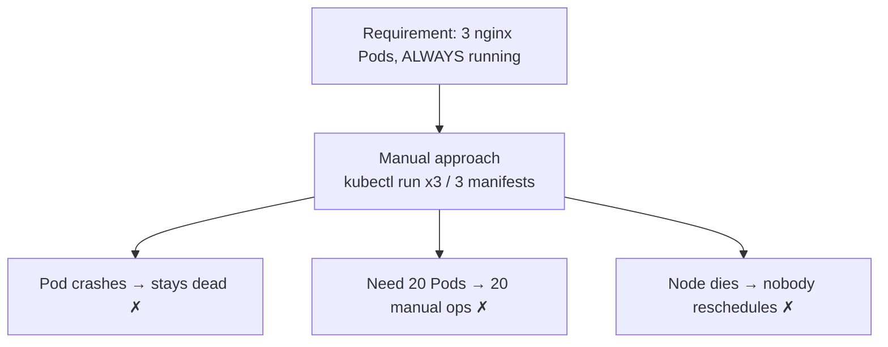
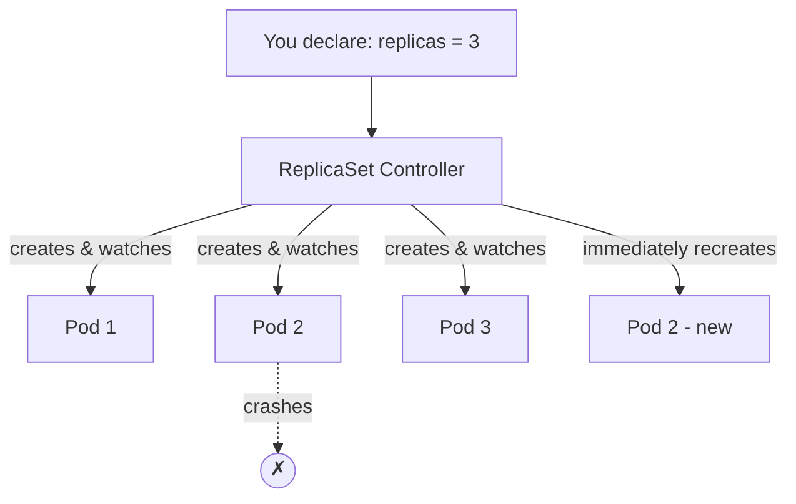
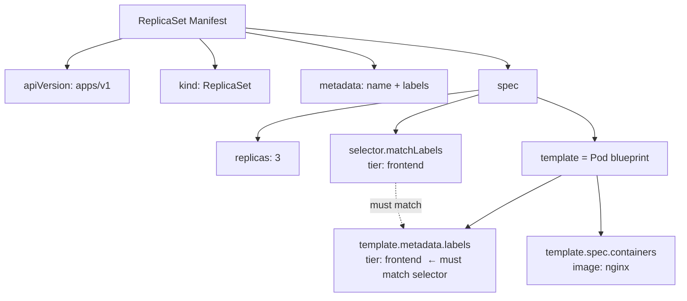
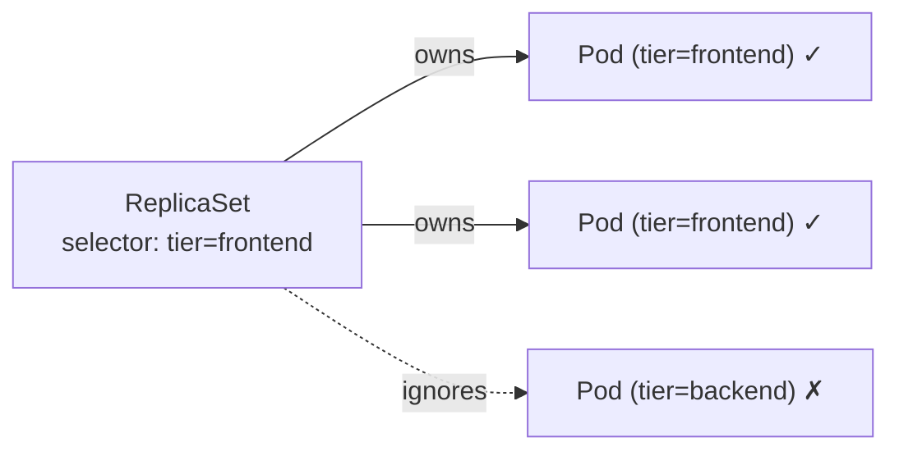
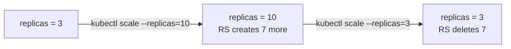
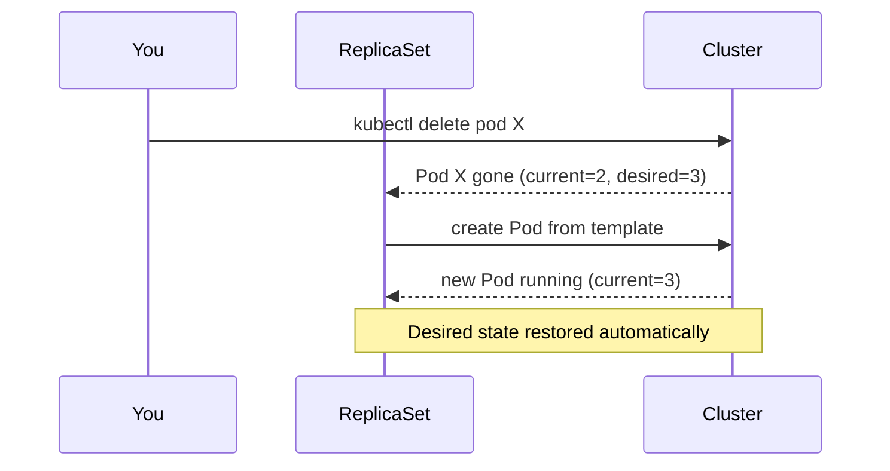
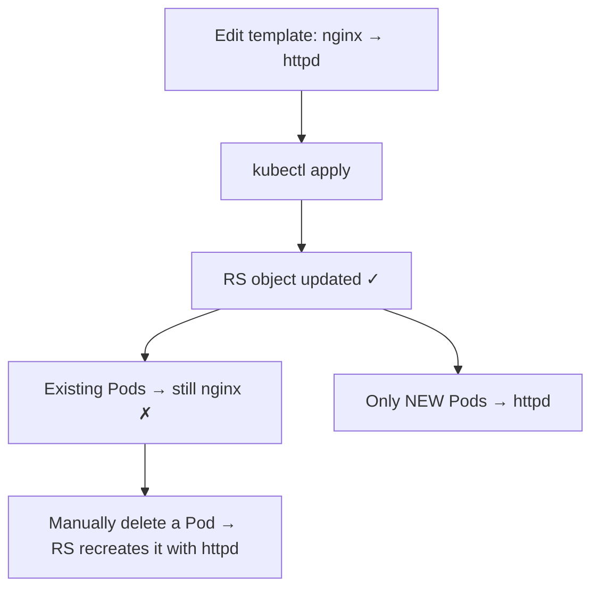
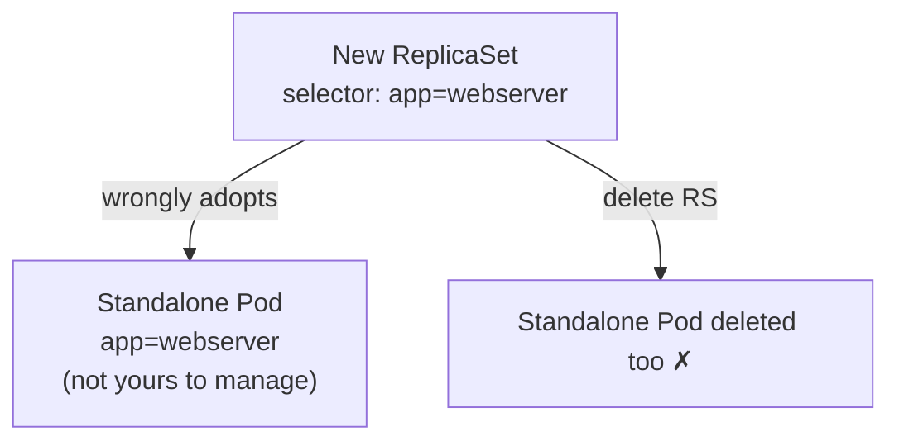
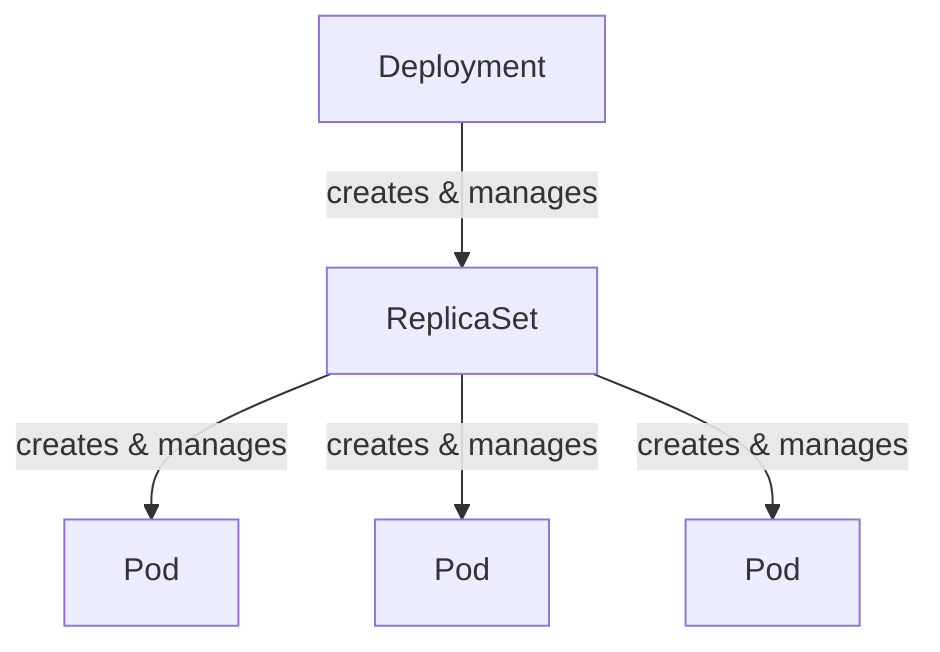
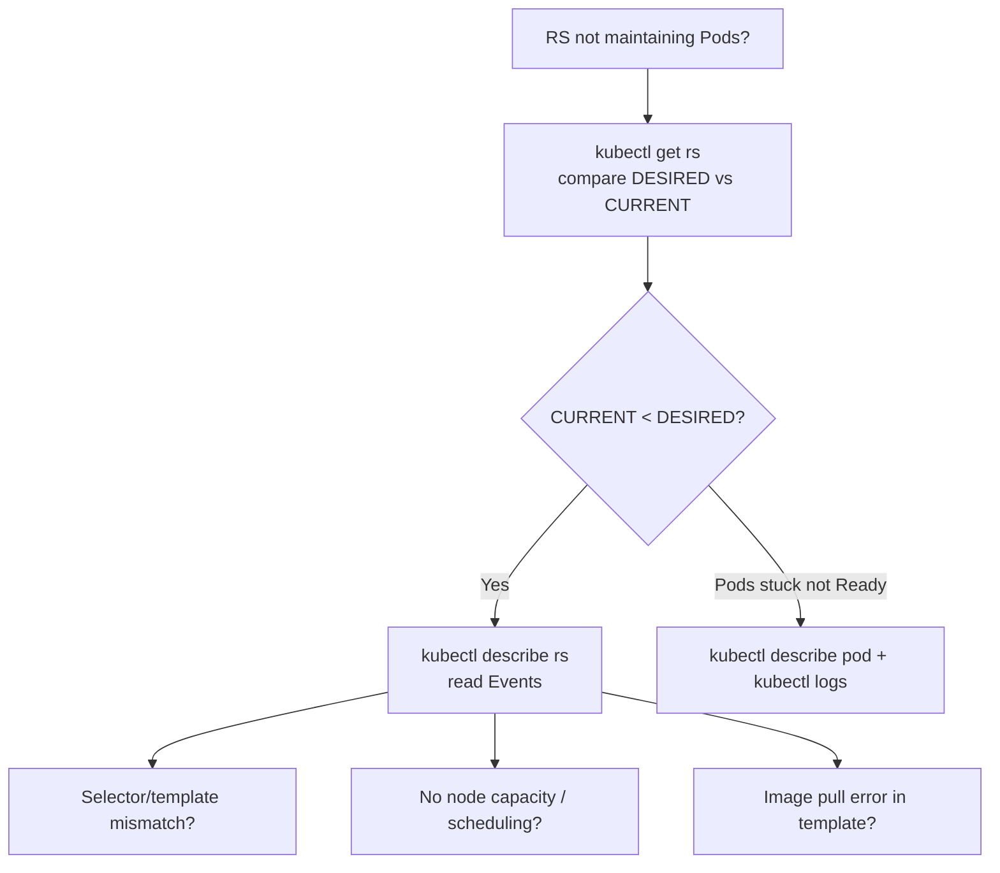

# Kubernetes ReplicaSet — Domain 2: Workloads & Scheduling

> **A ReplicaSet's one job:** keep a stable, desired number of identical Pods running at all times — recreating them when they fail and scaling them on demand.

---

## 1. The Problem — Why Manual Pod Management Fails

Take a simple-sounding requirement:

> **Run three Pods based on the `nginx` image, all the time.**

You could satisfy the *first half* manually — run `kubectl run` three times, or write three Pod manifests and `kubectl apply` each:

- ✅ Three Pods based on `nginx` are running.
- ❌ But they are **not** guaranteed to run *all the time*.

The phrase "all the time" is where manual management breaks down. Three specific problems appear.

### Challenge 1: No Automatic Recovery

```
   Worker Node
┌────────────────────┐
│  nginx-pod-1  ✗    │ ◄── crashed
│  nginx-pod-2  ✓    │
│  nginx-pod-3  ✗    │ ◄── crashed (or whole node dies)
└────────────────────┘
```

If a Pod (or the whole worker node) crashes, **Kubernetes does not recreate manually-created Pods**. Someone has to notice the failure and recreate the Pod by hand — impractical in production where uptime matters.

### Challenge 2: Scaling Is Painful

Requirement today: **3 Pods**. Next week: **20 Pods**. Manually, that means running `kubectl run` 20 times, or maintaining 20 manifest files. Time-consuming, error-prone, and it doesn't scale *down* cleanly either.

### Challenge 3: No Load Distribution Strategy

A bare set of Pods has no controller ensuring they stay spread and available as demand shifts. You're managing count, health, and placement entirely on your own.



---

## 2. The Solution — What Is a ReplicaSet?

A **ReplicaSet (RS)** is a Kubernetes controller whose sole responsibility is to **maintain a stable set of replica Pods running at any given time**.

Instead of creating Pods yourself, you *declare intent*:

> "I want **3** Pods of this template running — always."

The ReplicaSet then takes ownership of:

- **Creating** the Pods from a template.
- **Monitoring** them continuously.
- **Recreating** any Pod that dies (or is deleted, or whose node fails).
- **Scaling** the count up or down when you change the desired number.



This is **desired-state management**: you tell Kubernetes *what* you want, not *how* to achieve it. The controller reconciles reality to match your declaration on a continuous loop.

> **Beyond availability, ReplicaSets also help with load and placement.** When demand rises, more replicas share the load; if a node runs low on resources, new Pods can be scheduled onto other nodes in the cluster.

---

## 3. ReplicaSet vs ReplicationController — Know the History

You will see **ReplicationController (RC)** in older material and exam questions. It's the *predecessor* to the ReplicaSet and does almost the same job.

| Aspect | ReplicationController (old) | ReplicaSet (modern) |
| ------ | --------------------------- | ------------------- |
| `apiVersion` | `v1` | `apps/v1` |
| `kind` | `ReplicationController` | `ReplicaSet` |
| `selector` | Optional / implicit | **Required**, and supports `matchLabels` |
| Status | Legacy, being phased out | Current standard |

> ⚠️ **Exam trap:** The `apiVersion` differs. A ReplicaSet uses **`apps/v1`**; a ReplicationController uses **`v1`**. Using the wrong one is a common cause of `error validating data` failures.

> 💡 In practice you rarely create either directly — a **Deployment** manages ReplicaSets for you (covered at the end). But you *must* understand ReplicaSets because Deployments are built on top of them, and they show up throughout the CKA.

---

## 4. How ReplicaSet Works — Desired vs Current

The ReplicaSet constantly compares two numbers:

- **Desired** — how many Pods you asked for.
- **Current** — how many are actually running.

Its reconciliation loop works to make them equal:

```
Desired = Current   ✓  → do nothing
Desired > Current   →  create Pods
Desired < Current   →  delete Pods
```

```bash
kubectl get replicaset
# NAME                  DESIRED   CURRENT   READY   AGE
# frontend-replicaset   3         3         3       19s
```

| Column | Meaning |
| ------ | ------- |
| `DESIRED` | Replicas you requested in the spec |
| `CURRENT` | Pods that currently exist |
| `READY` | Pods that passed readiness and can serve traffic |

If a Pod is deleted, `CURRENT` drops to 2, the loop detects the gap, and a new Pod is created — bringing it back to 3 within seconds.

---

## 5. The ReplicaSet Manifest (YAML)

> ⚠️ Unlike Pods, a ReplicaSet **cannot be created with a simple `kubectl run`**. It *must* be defined in a YAML manifest.

Every Kubernetes object shares the same four root fields — `apiVersion`, `kind`, `metadata`, `spec`. Here is a complete ReplicaSet:

```yaml
apiVersion: apps/v1          # ReplicaSet lives in the apps/v1 API group
kind: ReplicaSet
metadata:
  name: frontend-replicaset  # name of the ReplicaSet object
  labels:
    app: myapp
    tier: frontend
spec:
  replicas: 3                # desired number of Pods
  selector:                  # WHICH Pods this RS owns
    matchLabels:
      tier: frontend
  template:                  # BLUEPRINT for Pods it creates
    metadata:
      labels:
        app: myapp
        tier: frontend       # MUST match the selector above
    spec:
      containers:
        - name: nginx-container
          image: nginx
```

### The three fields inside `spec` that matter

| Field | Role |
| ----- | ---- |
| `replicas` | How many Pods to keep running (the desired count). |
| `selector` | The rule (via `matchLabels`) that tells the RS **which Pods belong to it**. |
| `template` | A full **Pod definition** used as the blueprint whenever the RS needs to create a Pod. |

**The `template` is just a Pod spec.** Everything you'd normally write in a standalone Pod manifest (its `metadata.labels`, `spec.containers`, `image`, etc.) goes here — minus the `apiVersion` and `kind`, because it's nested. The RS stamps out new Pods from this blueprint.



> 💡 **Is the `template` required even if matching Pods already exist?** Yes. Even if three correctly-labelled Pods are already running, the `template` is mandatory — the RS needs a blueprint to recreate Pods when one fails.

---

## 6. Labels and Selectors — The Heart of ReplicaSet

This is the single most important concept to master. It's how a ReplicaSet knows *which* Pods it's responsible for.

### Labels

The RS attaches the `template`'s labels to every Pod it creates. Verify with:

```bash
kubectl get pods --show-labels
# NAME                        READY   STATUS    LABELS
# frontend-replicaset-ab12x   1/1     Running   app=myapp,tier=frontend
# frontend-replicaset-cd34y   1/1     Running   app=myapp,tier=frontend
```

### Selectors

The `selector.matchLabels` block is the RS's ownership filter. The RS **manages exactly the Pods whose labels match the selector** — no more, no less. That matching is what powers monitoring, recreation, scaling, and deletion.



> ⚠️ **The golden rule:** `spec.selector.matchLabels` **must match** `spec.template.metadata.labels`. If they don't, Kubernetes rejects the manifest with `selector does not match template labels`.

---

## 7. Creating & Inspecting a ReplicaSet

### Create

```bash
kubectl apply -f replica-set.yaml
# or (older style, from the KodeKloud lesson)
kubectl create -f replica-set.yaml
# replicaset.apps/frontend-replicaset created
```

### Inspect

```bash
kubectl get rs                     # 'rs' is the short name for replicaset
# NAME                  DESIRED   CURRENT   READY   AGE
# frontend-replicaset   3         3         3       25s

kubectl get pods
# NAME                        READY   STATUS    RESTARTS   AGE
# frontend-replicaset-ab12x   1/1     Running   0          25s
# frontend-replicaset-cd34y   1/1     Running   0          25s
# frontend-replicaset-ef56z   1/1     Running   0          25s
```

> 💡 Notice the Pod names are **prefixed with the ReplicaSet name** (`frontend-replicaset-...`). That naming reveals which controller created them.

```bash
kubectl describe rs frontend-replicaset   # events, selector, template, pod status
```

| Command | Short form | Purpose |
| ------- | ---------- | ------- |
| `kubectl get replicaset` | `kubectl get rs` | List ReplicaSets + desired/current |
| `kubectl get pods` | — | See the Pods it created |
| `kubectl describe rs <name>` | — | Full details, events, current image |
| `kubectl get pods --show-labels` | — | Verify labels the RS applied |

---

## 8. Scaling a ReplicaSet

Scaling means changing `replicas`. Three ways:

### Option A — `kubectl scale` (imperative, fastest)

```bash
kubectl scale --replicas=5 rs frontend-replicaset
# replicaset.apps/frontend-replicaset scaled
```

The RS creates two more Pods (3 → 5). Scale down the same way:

```bash
kubectl scale --replicas=1 rs frontend-replicaset
# extra Pods are removed automatically — no manual deletion
```

### Option B — `kubectl scale -f` (from the file)

```bash
kubectl scale --replicas=6 -f replica-set.yaml
```

### Option C — Edit the YAML then `replace`/`apply` (declarative)

```bash
# change replicas: 3  →  replicas: 6 in the file, then:
kubectl replace -f replica-set.yaml
# or
kubectl apply -f replica-set.yaml
```



> ⚠️ **Consistency gotcha:** If you scale with the `kubectl scale` **command**, the YAML file still says the old number. Next time you `apply` the file, it will scale back. **Best practice:** keep the YAML as the source of truth — after an imperative scale, update the file to match.

---

## 9. Automatic Pod Recovery (Self-Healing Demo)

This is the behaviour that makes ReplicaSets valuable. Delete a Pod and watch it come back.

```bash
kubectl get pods
# 3 pods running, all AGE ~5m

kubectl delete pod frontend-replicaset-ab12x
# pod deleted

kubectl get pods
# STILL 3 pods — one has AGE 3s (freshly recreated by the RS)
```

The RS detected `CURRENT (2) < DESIRED (3)`, and immediately created a replacement from the `template`. You never intervene.



---

## 10. Limitations of ReplicaSet — The Three Challenges

ReplicaSet is great at *maintaining count*, but it has real limitations. These are exactly why **Deployments** exist.

### Challenge 1: It Does NOT Update Existing Pods

Say your RS runs `nginx`. A new app version ships, so you edit the template to `httpd` and re-apply:

```bash
kubectl apply -f replica-set.yaml   # template image: nginx → httpd
```

The RS *object* updates, but **existing Pods keep running the old image**. Only **newly created** Pods use `httpd`.

```bash
kubectl describe rs frontend-replicaset   # Image: httpd   (new template)
kubectl describe pod <existing-pod>       # Image: nginx   (still old!)
```

**Why?** A ReplicaSet is designed to maintain the *number* of Pods, not to *roll out changes* to running Pods.

**Ugly workaround (never in production):** scale to `0` (all Pods die → app is DOWN), then scale back to `3` (new Pods pick up the new image). The downtime makes this unacceptable for production.



### Challenge 2: No Rollback

If a new configuration (State 2) introduces a bug, a ReplicaSet **cannot revert** to the previous good configuration (State 1). There's no version history and no `undo`. Production needs rollback; RS alone doesn't provide it.

### Challenge 3: Label Collision

Because a ReplicaSet claims Pods purely by label match, an **unrelated Pod that already carries the matching label gets adopted**.

```
Existing standalone Pod:   labels: app=webserver
New ReplicaSet selector:   matchLabels: app=webserver
→ RS counts the standalone Pod as one of its own
→ deleting the RS can delete that standalone Pod too
```



**Fix — use specific, multi-label selectors** so accidental matches can't happen:

```yaml
selector:
  matchLabels:
    app: webserver
    env: prod        # add a distinguishing label
```

Now the RS only manages Pods carrying **both** labels. The unrelated `app=webserver` Pod (without `env=prod`) is safe.

---

## 11. Why Deployment Exists (The Bridge)

Every ReplicaSet limitation above is solved by a **Deployment**, which sits *on top of* ReplicaSets:

| ReplicaSet limitation | Deployment solution |
| --------------------- | ------------------- |
| Doesn't update existing Pods | Performs **rolling updates** — replaces Pods gradually, zero downtime |
| No rollback | `kubectl rollout undo` reverts to a previous revision |
| Manual, risky version changes | Tracks **revision history** of every rollout |



> 💡 **Rule of thumb:** In real work you deploy **Deployments**, not bare ReplicaSets. But the ReplicaSet is doing the actual Pod-count management underneath — which is why understanding it is non-negotiable.

---

## 12. Command Reference

| Task | Command | Notes |
| ---- | ------- | ----- |
| Create RS from file | `kubectl apply -f rs.yaml` | Or `kubectl create -f rs.yaml` |
| List ReplicaSets | `kubectl get rs` | `rs` = short name |
| List Pods | `kubectl get pods` | Names prefixed with RS name |
| Show labels | `kubectl get pods --show-labels` | Verify selector matching |
| Detailed view | `kubectl describe rs <name>` | Events, template, current image |
| Scale (imperative) | `kubectl scale --replicas=5 rs <name>` | Fast; doesn't update YAML |
| Scale (from file) | `kubectl scale --replicas=5 -f rs.yaml` | |
| Update from file | `kubectl replace -f rs.yaml` | Replaces the object |
| Delete RS (and its Pods) | `kubectl delete rs <name>` | Deletes owned Pods too |
| Delete RS, keep Pods | `kubectl delete rs <name> --cascade=orphan` | Leaves Pods running |
| Edit live RS | `kubectl edit rs <name>` | Opens the live object in an editor |

> 💡 **CKA speed tip:** ReplicaSets can't be generated by `kubectl run`, but you can scaffold one fast by generating a Deployment's YAML and swapping `kind: Deployment` → `kind: ReplicaSet`:
> ```bash
> kubectl create deployment temp --image=nginx --replicas=3 --dry-run=client -o yaml > rs.yaml
> # then edit kind and remove the strategy/status fields
> ```

---

## 13. Best Practices

- **Prefer Deployments over bare ReplicaSets** for anything real — you get rolling updates and rollback for free.
- **Keep the YAML as the source of truth.** After an imperative `kubectl scale`, update the file's `replicas` to match.
- **Use specific, multi-label selectors** (`app` + `env` + `tier`) to prevent label-collision adoptions.
- **Always keep `selector.matchLabels` identical to `template.metadata.labels`** — mismatches are rejected outright.
- **Set resource `requests`/`limits`** in the container template so replicas schedule predictably across nodes.
- **Never scale to zero in production to force an image change** — that's guaranteed downtime. Use a Deployment's rolling update instead.
- **Version-control your manifests** (declarative workflow) so changes are reviewable and repeatable.

---

## 14. Common Mistakes & Misconceptions

| Mistake / Misconception | Reality |
| ----------------------- | ------- |
| Using `apiVersion: v1` for a ReplicaSet | RS needs **`apps/v1`**; `v1` is for the old ReplicationController. |
| `selector` doesn't match `template` labels | Manifest is rejected: *selector does not match template*. |
| "Editing the template updates running Pods" | It only affects **new** Pods; existing Pods keep the old spec. |
| "ReplicaSet can roll back" | It cannot — no revision history. Use a Deployment. |
| Reusing a common label like `app=web` in the selector | May **adopt unrelated Pods**; use multiple, specific labels. |
| Trying `kubectl run` to make a ReplicaSet | Not supported — RS requires a YAML manifest. |
| Deleting the RS to "clean up config" | It **deletes the owned Pods too** (unless `--cascade=orphan`). |
| Forgetting the `template` because Pods already exist | `template` is always required as the recreation blueprint. |
| Scaling to 0 to change images | Causes an outage; new Pods only appear on scale-up. |

---

## 15. Troubleshooting



| Symptom | Likely cause | Fix |
| ------- | ------------ | --- |
| `error: selector does not match template labels` | `matchLabels` ≠ `template.metadata.labels` | Align the two label sets |
| RS created but `CURRENT = 0` | Scheduling failure / bad image in template | `kubectl describe rs` → Events; check image name & node capacity |
| RS adopted an unexpected Pod | Label collision with a standalone Pod | Use more specific multi-label selector |
| Changed image but app still old | RS doesn't update existing Pods | Use a Deployment (rolling update) or recreate Pods |
| Pods `Pending` | No node has room / taints | `kubectl describe pod` → Events |
| `apiVersion` error on apply | Wrong API group | Use `apps/v1` |

> 💡 **Debug reflex:** `kubectl get rs` (is desired = current?) → `kubectl describe rs <name>` (Events explain *why* not) → `kubectl describe pod` / `kubectl logs` (Pod-level failures).

---

## 16. Hands-on Labs

### Lab 1 — Create, Inspect, Self-Heal

**Goal:** See a ReplicaSet maintain the desired count.

```bash
# Step 1: create replica-set.yaml (use the manifest from Section 5)
vim replica-set.yaml

# Step 2: apply and verify
kubectl apply -f replica-set.yaml
kubectl get rs                    # DESIRED 3, CURRENT 3
kubectl get pods                  # 3 pods, names prefixed with RS name

# Step 3: prove self-healing
kubectl delete pod <one-pod-name>
kubectl get pods                  # still 3 — one has AGE of a few seconds

# Step 4: check labels
kubectl get pods --show-labels    # every pod carries tier=frontend
```

**Expected outcome:** Deleting a Pod never reduces the running count below 3.

### Lab 2 — Scale Up and Down

```bash
kubectl scale --replicas=5 rs frontend-replicaset
kubectl get pods                  # 5 pods now

kubectl scale --replicas=1 rs frontend-replicaset
kubectl get pods                  # RS removed 4 pods automatically
```

**Expected outcome:** The count tracks the desired value in both directions with no manual Pod deletion.

### Lab 3 — Prove the "No Update to Existing Pods" Limitation

```bash
# edit template image nginx → httpd in the YAML, then:
kubectl apply -f replica-set.yaml
kubectl describe rs frontend-replicaset | grep -i image   # httpd
kubectl describe pod <existing-pod> | grep -i image       # still nginx

# force the change by deleting a pod:
kubectl delete pod <existing-pod>
kubectl get pods                  # replacement pod now runs httpd
```

**Expected outcome:** Only recreated Pods adopt the new image — demonstrating why Deployments are needed for real rollouts.

### Lab 4 — Reproduce a Label Collision (then fix it)

```bash
# 1. create a standalone pod with the label the RS will select
kubectl run rogue-pod --image=nginx --labels="app=webserver"

# 2. apply an RS with selector matchLabels app=webserver, replicas=3
#    → RS counts rogue-pod as one of its 3 (creates only 2 new)
kubectl get pods --show-labels

# 3. delete the RS → rogue-pod is deleted too
kubectl delete rs <name>
kubectl get pods                  # rogue-pod gone

# FIX: rebuild the RS with a multi-label selector (app=webserver, env=prod)
#      so rogue-pod (missing env=prod) is never adopted
```

**Expected outcome:** You see the danger of loose selectors, and confirm that specific selectors isolate ownership.

---

## 17. Interview Questions (Basic → Advanced)

**Basic**

1. **What is a ReplicaSet?** — A controller that keeps a stable, desired number of identical Pods running, recreating any that fail.
2. **What problem does it solve over manual Pods?** — Manual Pods aren't recreated on failure and are painful to scale; the RS automates recovery and scaling.
3. **What `apiVersion` does a ReplicaSet use?** — `apps/v1`.
4. **What are the three key fields in a ReplicaSet's `spec`?** — `replicas`, `selector`, `template`.
5. **Can you create a ReplicaSet with `kubectl run`?** — No; it requires a YAML manifest.

**Intermediate**

6. **Difference between ReplicationController and ReplicaSet?** — RS is the modern version using `apps/v1` with a required, label-expression-capable `selector`; RC is the legacy `v1` object being phased out.
7. **What must be true about the selector and template labels?** — They must match, or the manifest is rejected.
8. **How does the RS know which Pods it owns?** — Via `selector.matchLabels` matching Pod labels.
9. **What's the difference between DESIRED and CURRENT?** — DESIRED is what you asked for; CURRENT is what actually exists. The RS reconciles them.
10. **How do you scale a ReplicaSet?** — `kubectl scale --replicas=N rs <name>`, or edit `replicas` in the YAML and re-apply.
11. **Is the `template` required if matching Pods already exist?** — Yes; it's the blueprint for recreating failed Pods.

**Advanced**

12. **If you change the image in the template, do running Pods update?** — No; only newly created Pods use the new image. Existing Pods keep the old one.
13. **Why can't a ReplicaSet do a zero-downtime image rollout?** — It only manages count, not rollout strategy; forcing change means scaling to zero (downtime) or manually deleting Pods.
14. **What is a label collision and how do you prevent it?** — When an unrelated Pod shares the selector's labels, the RS adopts it; prevent it with specific, multi-label selectors.
15. **What happens to Pods when you delete a ReplicaSet?** — They're deleted too, unless you use `--cascade=orphan`.
16. **Why do we use Deployments instead of ReplicaSets directly?** — Deployments add rolling updates, rollback, and revision history — the three things ReplicaSets lack.
17. **Does the RS re-run failed containers or create new Pods?** — It creates new Pods to restore the count; container-level restarts within a Pod are handled by the kubelet/restartPolicy, separate from RS behaviour.

---

## 18. Summary — Key Points to Remember

### The Full Picture

```
Manual Pods:
  kubectl run x3   ✗ no recovery, ✗ painful scaling, ✗ node failure = downtime

ReplicaSet:
  declare replicas=3 ──► RS reconciles DESIRED vs CURRENT
  ✓ self-healing   ✓ easy scaling   ✓ desired-state management
  ✗ no rolling update to existing Pods   ✗ no rollback   ✗ label-collision risk

Deployment (built on ReplicaSet):
  ✓ everything above + rolling updates + rollback + revision history
```

### Key Points

- A ReplicaSet **maintains the desired number of Pods** — self-healing and scalable.
- It uses `apiVersion: apps/v1` and requires `replicas`, `selector`, and `template`.
- **`selector.matchLabels` must match `template.metadata.labels`** — this is how it claims Pods.
- **Cannot be made with `kubectl run`** — YAML only.
- `DESIRED` vs `CURRENT`: the RS works to keep them equal.
- Delete a Pod → the RS **recreates it instantly**.
- Scale via `kubectl scale --replicas=N rs <name>`; keep the YAML in sync afterward.
- **Three limitations:** (1) doesn't update existing Pods, (2) no rollback, (3) label collisions.
- All three limitations are solved by **Deployments**, which manage ReplicaSets under the hood.
- Deleting an RS deletes its Pods unless `--cascade=orphan`.

---

*Next up:* **Deployments** — rolling updates, rollbacks, and revision history built on top of everything here.
