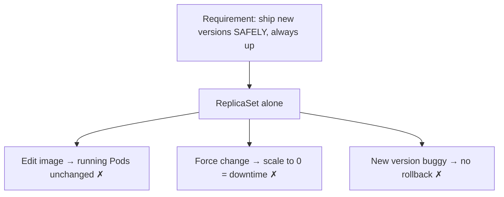
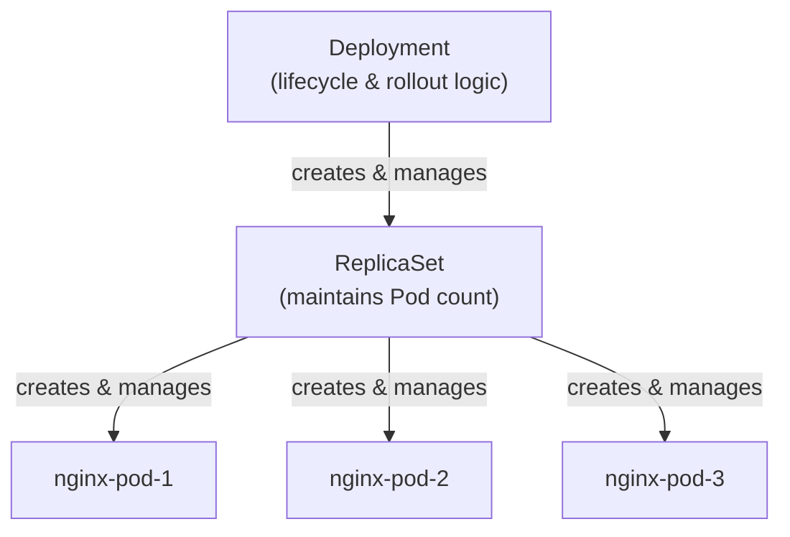
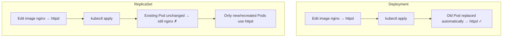
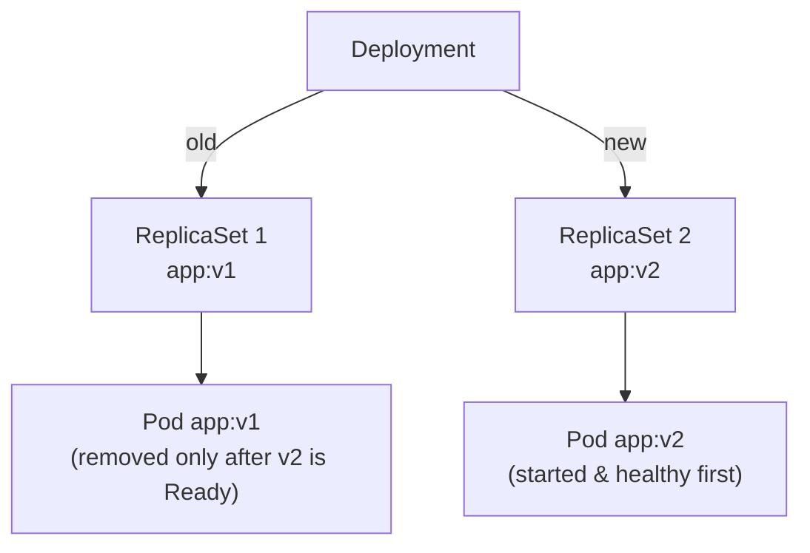
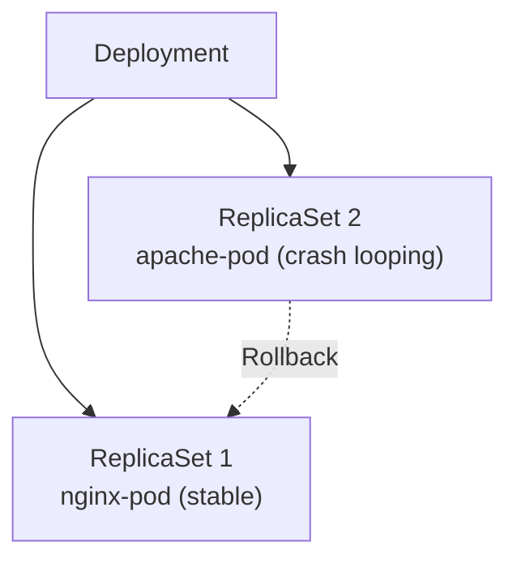
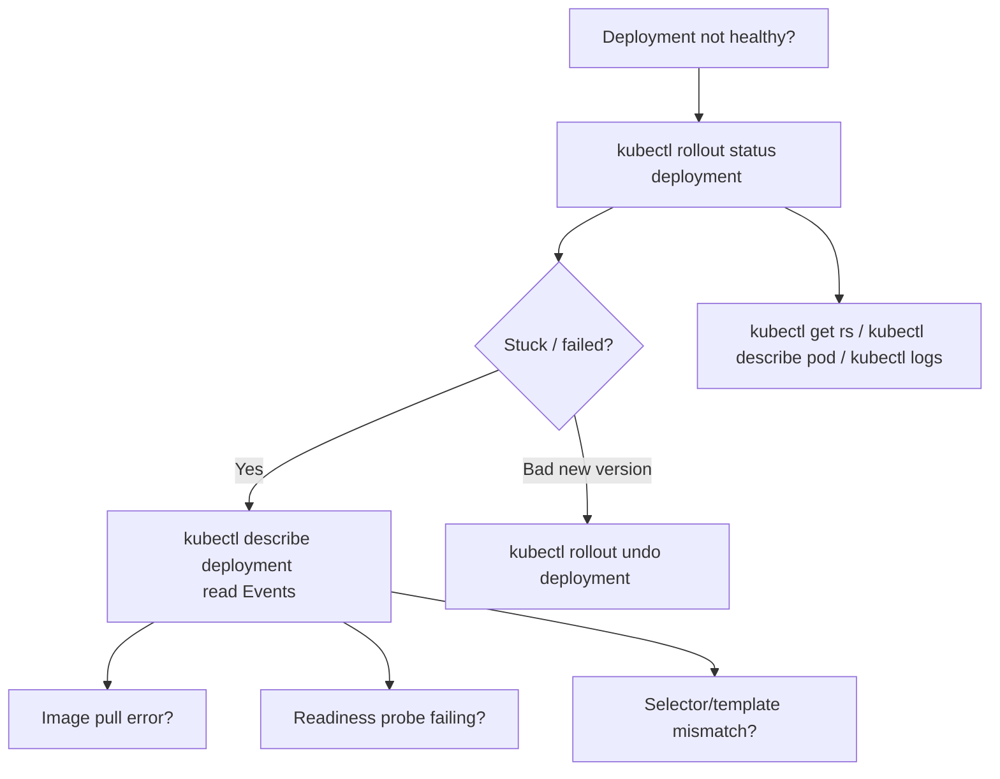

# Kubernetes Deployments — Domain 2: Workloads & Scheduling

> **A Deployment's one job:** manage your application's lifecycle — rolling out new versions with zero downtime, rolling them back when they break, and keeping a full history of every change — all while a ReplicaSet quietly maintains the Pod count underneath.

---

## 1. The Problem — What ReplicaSet Alone Can't Do

A **ReplicaSet** is excellent at one thing: keeping the desired number of identical Pods running. But real production applications need more than a stable count — they need to *change over time*, safely.

Three gaps appear the moment you try to ship a new version:

### Gap 1: Updating the image doesn't touch running Pods

With a bare ReplicaSet, editing the template image from `nginx` → `httpd` and re-applying updates the **object**, but every **existing Pod keeps the old image**. Only newly created Pods pick up the change.

### Gap 2: No zero-downtime rollout

To force new images onto a ReplicaSet you'd scale to `0` (app goes **down**) and back up — an outage. There's no built-in "replace them gradually" mechanism.

### Gap 3: No rollback, no history

If a new version is buggy, a ReplicaSet has no `undo` and no memory of the previous good state. You're on your own.



Every one of these is exactly what a **Deployment** was built to solve.

---

## 2. Simple Analogy — Camera and Lens

The relationship between a Deployment and a ReplicaSet is best understood with a **camera and lens**:

| Real world | Kubernetes | Role |
| ---------- | ---------- | ---- |
| 📷 Camera **body** | **ReplicaSet** | The core mechanism that captures the right number of photos (Pods) |
| 🔭 Camera **lens** | **Deployment** | Sits on top and *extends* the camera — better zoom, new perspectives (rolling updates, rollbacks, versioning) |

- The **camera body (ReplicaSet)** does the actual work of capturing the right number of photos (keeping Pods running).
- The **lens (Deployment)** doesn't just sit on top — it **enhances and extends** the body's functionality, unlocking capabilities the body alone doesn't have.

> 💡 A **Deployment is a higher-level abstraction built on top of ReplicaSets.** It *uses a ReplicaSet behind the scenes* to create and manage Pods, then layers advanced lifecycle features over it.

---

## 3. What Is a Deployment?

A **Deployment** is a Kubernetes controller that manages ReplicaSets (which in turn manage Pods) and adds production-grade lifecycle features on top.

According to the Kubernetes docs, a Deployment lets you:

- **Run multiple instances** of your app for high availability and load balancing.
- **Perform rolling updates** — update the container image gradually so the app is never fully down.
- **Roll back** quickly to a previous version if an upgrade misbehaves.
- **Pause and resume** rollouts to coordinate multiple changes.

### The hierarchy: Deployment → ReplicaSet → Pods

You create **one** Deployment; it creates and owns a **ReplicaSet**; the ReplicaSet creates and owns the **Pods**.



> A Deployment **not only manages ReplicaSets** but also **provides advanced features** like rolling updates, rollbacks, and versioning.

---

## 4. Proof That a Deployment Uses a ReplicaSet

Apply a ReplicaSet manifest **and** a Deployment manifest, both with `replicas: 1` and `image: nginx`. Then look at what exists:

```bash
kubectl get pods
# 2 pods running — one from the RS, one from the Deployment

kubectl get replicasets
# NAME                          DESIRED   CURRENT   READY   AGE
# frontend-replicaset           1         1         1       30s   ← the one you made
# nginx-deployment-6d9f8c7b5d   1         1         1       30s   ← created BY the Deployment
```

Even though you only created **one** Deployment, **two** ReplicaSets appear. The second one was created *by the Deployment*, and its name follows the tell-tale convention:

```
<deployment-name>-<replicaset-hash>
```

That naming (`nginx-deployment-6d9f8c7b5d`) is the fingerprint proving the Deployment manages its Pods **through** a ReplicaSet.

---

## 5. Feature Comparison — Updating the Container Image

This is the clearest demonstration of *why* Deployments exist. Change the image in **both** a ReplicaSet manifest and a Deployment manifest from `nginx` → `httpd`, apply both, and watch the difference.

### ReplicaSet behaviour

- The RS object updates its template.
- **Existing Pods keep running the old `nginx` image.**
- Only Pods created *after* the change use `httpd`.

```bash
kubectl describe pod <replicaset-pod>   # Image: nginx   ← still old!
```

If you *manually delete* the RS-managed Pod, the RS recreates it — and only *then* does the replacement use `httpd`.

### Deployment behaviour

- The Deployment automatically **replaces the running Pod** with one using the new image.
- **No manual intervention required.**

```bash
kubectl describe pod <deployment-pod>   # Image: httpd   ← updated automatically
```



> 🎯 **Use-case: Update the Container Image.** With a Deployment you can easily change specs like the container image (`app:v1` → `app:v2`) and the Deployment takes care of transitioning the running Pods for you.

---

## 6. The Deployment Manifest (YAML)

A Deployment manifest is **almost identical** to a ReplicaSet manifest — the only difference is `kind: Deployment`. If you know ReplicaSets, you already know this.

```yaml
apiVersion: apps/v1          # Deployment lives in the apps/v1 API group
kind: Deployment
metadata:
  name: nginx-deployment     # name of the Deployment object
  labels:
    app: myapp
    type: front-end
spec:
  replicas: 3                # desired number of Pods
  selector:                  # WHICH Pods this Deployment owns
    matchLabels:
      type: front-end
  template:                  # BLUEPRINT for the Pods
    metadata:
      labels:
        app: myapp
        type: front-end      # MUST match the selector above
    spec:
      containers:
        - name: nginx-container
          image: nginx
```

### The four root fields (same as every K8s object)

| Field | Purpose |
| ----- | ------- |
| `apiVersion` | `apps/v1` — the API group Deployments belong to |
| `kind` | `Deployment` |
| `metadata` | Name + labels of the Deployment itself |
| `spec` | The desired state: `replicas`, `selector`, `template` |

### The three fields inside `spec` that matter

| Field | Role |
| ----- | ---- |
| `replicas` | How many Pods to keep running |
| `selector` | The `matchLabels` rule telling the Deployment which Pods it owns |
| `template` | A full Pod definition used as the blueprint for every Pod it creates |

> ⚠️ **The golden rule (same as ReplicaSet):** `spec.selector.matchLabels` **must match** `spec.template.metadata.labels`, or the manifest is rejected.

---

## 7. Creating a Deployment

### Option A — Imperatively with `kubectl create deployment`

Unlike a ReplicaSet, a Deployment **can** be created with a single command:

```bash
kubectl create deployment nginx-deployment --image=nginx
# deployment.apps/nginx-deployment created

kubectl get deployments
# NAME               READY   UP-TO-DATE   AVAILABLE   AGE
# nginx-deployment   1/1     1            1           8s
```

Because a Deployment uses a ReplicaSet internally, the RS and Pod appear too:

```bash
kubectl get rs      # one ReplicaSet, named nginx-deployment-<hash>
kubectl get pods    # one Pod, named nginx-deployment-<hash>-<id>
```

### Option B — Declaratively from a manifest

```bash
kubectl apply -f deployment.yaml
# or (older style)
kubectl create -f deployment.yaml
```

### Generate the manifest fast (CKA speed tip)

```bash
kubectl create deployment nginx-deployment --image=nginx \
  --replicas=3 --dry-run=client -o yaml > deployment.yaml
```

`--dry-run=client -o yaml` builds the YAML **without** creating anything — edit it, then `kubectl apply -f`.

> 💡 **Handy short forms:** `kubectl get deploy` (deployments), `kubectl get rs` (replicasets), `kubectl get all` (deployments + RS + Pods + services in one shot).

---

## 8. Rolling Updates — Zero-Downtime Deploys

A **rolling update** is the marquee feature. When you move from **App v1** to **App v2**, the Deployment does **not** kill the old Pod first. Instead:

1. **Create a new ReplicaSet** for v2.
2. **Launch a new Pod** using the v2 image.
3. **Wait** until the new Pod is healthy / Running.
4. **Only then remove** the old v1 Pod.

This guarantees the app stays available throughout the transition.



### Watch it happen

```bash
# edit the image in deployment.yaml (or use set image), then:
kubectl apply -f deployment.yaml

kubectl get pods -w        # -w = watch, live updates
# Observe the sequence:
#   old Pod: Running
#   new Pod: Pending → ContainerCreating → Running
#   ONLY NOW → old Pod: Terminating
```

The old Pod is terminated **only after** the new Pod reaches `Running`. That ordering *is* the rolling update.

### Updating the image without editing YAML — `kubectl set image`

```bash
kubectl set image deployment/nginx-deployment nginx-container=httpd
# deployment.apps/nginx-deployment image updated
```

This triggers a fresh rollout (a new ReplicaSet + new revision) exactly like editing the file would.

> **Use-case: Rolling Update.** Deployments perform the update in a rollout manner to ensure your app is **not** down.

---

## 9. Rollout History & Revisions

Every rollout is recorded as a **revision**, letting you inspect how the app evolved and troubleshoot regressions.

```bash
kubectl rollout history deployment nginx-deployment
# deployment.apps/nginx-deployment
# REVISION  CHANGE-CAUSE
# 1         <none>
# 2         <none>
```

- The **first** apply creates **Revision 1**.
- Each image/spec change adds a new revision (**Revision 2**, **Revision 3**, …).
- **Each revision has its own ReplicaSet**, and each ReplicaSet stores its own Pod template.

```bash
kubectl get rs
# nginx-deployment-<hashA>   DESIRED 0   ← revision 1 (image: nginx), kept for rollback
# nginx-deployment-<hashB>   DESIRED 3   ← revision 2 (image: httpd), currently active
```

Inspecting the older RS shows `Image: nginx`; the newer RS shows `Image: httpd`. The Deployment keeps the old ReplicaSet around (scaled to 0) precisely so it can roll back to it instantly.

### Recording the change cause

That `<none>` under `CHANGE-CAUSE` is unhelpful. Populate it:

```bash
kubectl set image deployment/nginx-deployment nginx-container=httpd
kubectl annotate deployment/nginx-deployment \
  kubernetes.io/change-cause="update image to httpd"

# View details of a single revision:
kubectl rollout history deployment nginx-deployment --revision=2
```

---

## 10. Rollback — Reverting a Bad Version

Sometimes a new version is unstable (e.g. **crash looping**) and you need the previous version back **fast**. Because the Deployment kept the old ReplicaSet, rollback is near-instant.



### How rollback works under the hood

The Deployment simply **flips the desired replica counts** between ReplicaSets:

- Older (good) ReplicaSet: desired replicas → **restored** (e.g. 0 → 3).
- Newer (bad) ReplicaSet: desired replicas → **0**.

Result: old Pods are recreated, new Pods are removed — a fast, reliable revert with no rebuild.

### Roll back to the immediately previous revision

```bash
kubectl rollout undo deployment nginx-deployment
# deployment.apps/nginx-deployment rolled back

kubectl get rs
# older ReplicaSet: DESIRED 1   ← active again
# newer ReplicaSet: DESIRED 0   ← drained
```

### Roll back to a *specific* revision

Rather than only the last version, you can target any revision — invaluable in production where many revisions exist.

```bash
kubectl rollout history deployment nginx-deployment      # list available revisions
kubectl rollout undo deployment nginx-deployment --to-revision=1
```

### Check rollout status

```bash
kubectl rollout status deployment nginx-deployment
# Waiting for deployment "nginx-deployment" rollout to finish...
# deployment "nginx-deployment" successfully rolled out
```

---

## 11. Scaling a Deployment

Scaling works just like a ReplicaSet — change `replicas`.

```bash
kubectl scale deployment nginx-deployment --replicas=3
# deployment.apps/nginx-deployment scaled

kubectl get pods
# 3 pods now running
```

You can also scale declaratively (edit `replicas` in the YAML → `kubectl apply -f`) or live (`kubectl edit deployment nginx-deployment`).

> ⚠️ **Consistency gotcha:** an imperative `kubectl scale` leaves the YAML file's `replicas` stale. The next `apply` will scale back. Keep the manifest as the source of truth.

---

## 12. ReplicaSet vs Deployment — Key Differences

| Feature | ReplicaSet | Deployment |
| ------- | ---------- | ---------- |
| **Abstraction level** | Lower-level | Higher-level |
| **Primary function** | Ensures a specific number of replicas are running | Manages ReplicaSets **and** handles updates |
| **Rolling updates** | ❌ Not supported | ✅ Supported with configurable strategies |
| **Rollbacks** | ❌ Not supported | ✅ Supported with version history |
| **Use case** | Simple, static workloads | Dynamic workloads with frequent updates |

> 🎯 **Bottom line:** ReplicaSet keeps the count; Deployment manages the *lifecycle*. In production you deploy **Deployments** — the ReplicaSet is just the count-keeper working underneath.

---

## 13. Command Reference

| Task | Command | Notes |
| ---- | ------- | ----- |
| Create (imperative) | `kubectl create deployment <name> --image=` | Fastest way to start |
| Create (declarative) | `kubectl apply -f deployment.yaml` | Or `kubectl create -f` |
| Generate YAML | `kubectl create deployment <name> --image= --dry-run=client -o yaml` | Scaffold a manifest |
| List Deployments | `kubectl get deployments` | Short form `deploy` |
| List ReplicaSets | `kubectl get rs` | See the `<name>-<hash>` RS |
| List everything | `kubectl get all` | Deployment + RS + Pods |
| Detailed view | `kubectl describe deployment <name>` | Events, strategy, image |
| Update image | `kubectl set image deployment/<name> <container>=` | Triggers a rollout |
| Watch rollout | `kubectl get pods -w` | See old→new transition |
| Rollout status | `kubectl rollout status deployment <name>` | Waits for completion |
| Rollout history | `kubectl rollout history deployment <name>` | Lists revisions |
| Inspect a revision | `kubectl rollout history deployment <name> --revision=N` | Template of revision N |
| Roll back (previous) | `kubectl rollout undo deployment <name>` | Reverts one step |
| Roll back (specific) | `kubectl rollout undo deployment <name> --to-revision=N` | Targets revision N |
| Scale | `kubectl scale deployment <name> --replicas=N` | Same as RS |
| Edit live | `kubectl edit deployment <name>` | Opens the live object |
| Delete | `kubectl delete deployment <name>` | Removes RS + Pods too |

---

## 14. Best Practices

- **Always use Deployments** for real, long-running apps — never bare Pods or bare ReplicaSets.
- **Keep the YAML as the source of truth.** After an imperative `scale`/`set image`, update the manifest to match.
- **Record `change-cause`** (`--record` or `kubectl annotate ... kubernetes.io/change-cause=...`) so `rollout history` is actually readable.
- **Watch `kubectl rollout status`** after an update — don't assume success.
- **Use specific, multi-label selectors** to avoid accidentally adopting unrelated Pods (inherited from ReplicaSet behaviour).
- **Keep `selector.matchLabels` identical to `template.metadata.labels`** — mismatches are rejected.
- **Set resource `requests`/`limits`** in the container template so Pods schedule predictably.
- **Test rollbacks** before you need them — know that `rollout undo` and `--to-revision` exist and work.

---

## 15. Common Mistakes & Misconceptions

| Mistake / Misconception | Reality |
| ----------------------- | ------- |
| "A Deployment replaces the ReplicaSet" | It **uses** a ReplicaSet under the hood — both exist. |
| Using `apiVersion: v1` for a Deployment | Deployments need **`apps/v1`**. |
| "Editing a ReplicaSet's image updates running Pods" | No — only a **Deployment** transitions running Pods automatically. |
| "Rollback rebuilds the old version" | No — the old ReplicaSet was kept; rollback just re-scales it. |
| Expecting `kubectl run` to make a Deployment | `kubectl run` makes a **Pod**; use `kubectl create deployment`. |
| Scaling to 0 to change images | That's downtime — a Deployment does a **rolling update** instead. |
| Ignoring `CHANGE-CAUSE` showing `<none>` | Annotate the change so history is meaningful. |
| Deleting a Deployment to "clean config" | It **deletes the owned ReplicaSets and Pods** too. |

---

## 16. Troubleshooting



| Symptom | Likely cause | Fix |
| ------- | ------------ | --- |
| Rollout stuck (`UP-TO-DATE` < `replicas`) | New Pods never become Ready (bad image, failing probe) | `kubectl describe deployment` → Events; `kubectl logs <pod>` |
| `error: selector does not match template labels` | `matchLabels` ≠ `template.metadata.labels` | Align the two label sets |
| New version crash looping | Bug in the new image | `kubectl rollout undo deployment <name>` |
| `apiVersion` error on apply | Wrong API group | Use `apps/v1` |
| Old image still running after apply | Watching the wrong Pod, or rollout in progress | `kubectl rollout status`; check `kubectl get pods` ages |
| Can't roll back | No prior revision recorded | Check `kubectl rollout history`; keep revision history limit > 0 |

> 💡 **Debug reflex:** `kubectl rollout status` (did it finish?) → `kubectl describe deployment` (Events explain *why not*) → `kubectl get rs` / `kubectl describe pod` / `kubectl logs` (Pod-level failures).

---

## 17. Hands-on Labs

### Lab 1 — Create a Deployment and See the ReplicaSet

```bash
kubectl create deployment nginx-deployment --image=nginx --replicas=3
kubectl get deployments            # READY 3/3
kubectl get rs                     # one RS named nginx-deployment-<hash>
kubectl get pods                   # 3 pods, prefixed with the RS name
```

**Expected:** one Deployment → one ReplicaSet → three Pods, names revealing the chain.

### Lab 2 — Rolling Update

```bash
# Terminal 1: watch
kubectl get pods -w

# Terminal 2: trigger the update
kubectl set image deployment/nginx-deployment nginx=httpd
```

**Expected:** a new Pod reaches `Running` **before** the old Pod is `Terminating` — zero downtime.

### Lab 3 — Inspect History and Roll Back

```bash
kubectl rollout history deployment nginx-deployment      # Revisions 1 and 2
kubectl get rs                                           # old RS DESIRED 0, new RS DESIRED 3

kubectl rollout undo deployment nginx-deployment         # back to previous
kubectl get rs                                           # counts flip back
kubectl describe pod <pod> | grep -i image               # image is nginx again
```

**Expected:** rollback flips ReplicaSet replica counts; no rebuild needed.

### Lab 4 — Roll Back to a Specific Revision

```bash
# make a couple of changes to build up revisions
kubectl set image deployment/nginx-deployment nginx=httpd
kubectl set image deployment/nginx-deployment nginx=nginx:1.25

kubectl rollout history deployment nginx-deployment      # Revisions 1, 2, 3
kubectl rollout undo deployment nginx-deployment --to-revision=1
```

**Expected:** the Deployment restores exactly the revision-1 template.

### Lab 5 — Scale, then Clean Up

```bash
kubectl scale deployment nginx-deployment --replicas=5
kubectl get pods                                         # 5 pods

kubectl delete deployment nginx-deployment
kubectl get rs                                           # gone
kubectl get pods                                         # gone
```

**Expected:** deleting the Deployment cascades to its ReplicaSets and Pods.

---

## 18. Interview Questions (Basic → Advanced)

**Basic**

1. **What is a Deployment?** — A higher-level controller that manages ReplicaSets (and thus Pods) and adds rolling updates, rollbacks, and versioning.
2. **How does a Deployment relate to a ReplicaSet?** — It sits on top and *uses* a ReplicaSet behind the scenes to maintain Pod count.
3. **What `apiVersion` does a Deployment use?** — `apps/v1`.
4. **Can you create a Deployment with one command?** — Yes: `kubectl create deployment <name> --image=` (unlike a ReplicaSet, which needs YAML).
5. **What are the three key `spec` fields?** — `replicas`, `selector`, `template`.

**Intermediate**

6. **What is a rolling update?** — New Pods are started and become healthy *before* old Pods are removed, giving zero downtime.
7. **How do you update the image without editing YAML?** — `kubectl set image deployment/<name> <container>=`.
8. **How does a Deployment store history?** — Each rollout is a revision with its own ReplicaSet; view via `kubectl rollout history`.
9. **How do you roll back?** — `kubectl rollout undo deployment <name>`, or `--to-revision=N` for a specific one.
10. **Why does `kubectl get rs` show ReplicaSets with DESIRED 0?** — They're old revisions kept around so rollback is instant.

**Advanced**

11. **What actually happens during a rollback?** — The Deployment re-scales the old ReplicaSet up and the current one to 0 — no rebuild.
12. **Difference between ReplicaSet and Deployment on image change?** — RS doesn't touch running Pods; Deployment transitions them automatically via rolling update.
13. **Why keep old ReplicaSets instead of deleting them?** — To enable fast, reliable rollbacks to any retained revision.
14. **What does deleting a Deployment remove?** — The Deployment, all its ReplicaSets, and all their Pods.
15. **How would you make `rollout history` show meaningful causes?** — Annotate `kubernetes.io/change-cause` (or use `--record`) on each change.

---

## 19. Summary — Key Points to Remember

### The Full Picture

```
ReplicaSet:
  declare replicas=3 ──► keeps DESIRED = CURRENT
  ✓ self-healing   ✓ scaling
  ✗ no image update to running Pods   ✗ no rolling update   ✗ no rollback

Deployment (built on ReplicaSet):
  ✓ everything above
  ✓ rolling updates (zero downtime)
  ✓ rollout history / revisions
  ✓ rollback (undo / --to-revision)
  ✓ image updates transition running Pods automatically
```

### Key Points

- A **Deployment manages ReplicaSets**, which manage Pods — camera **lens** on top of the camera **body**.
- Uses `apiVersion: apps/v1`; `spec` needs `replicas`, `selector`, `template` (same as ReplicaSet).
- The manifest is **almost identical** to a ReplicaSet's — only `kind: Deployment` differs.
- Create fast with `kubectl create deployment <name> --image=` (RS can't do this).
- **Rolling update:** new Pod becomes healthy **before** the old one is removed → zero downtime.
- Update the image live with `kubectl set image deployment/<name> <container>=`.
- **Every rollout is a revision** with its own ReplicaSet; view with `kubectl rollout history`.
- **Rollback** with `kubectl rollout undo` (or `--to-revision=N`) — it just re-scales the old ReplicaSet, so it's instant.
- Scale with `kubectl scale deployment <name> --replicas=N`.
- Deleting a Deployment **cascades** to its ReplicaSets and Pods.
- **In production, always use Deployments** — they add the lifecycle management ReplicaSets lack.

---

*Previously:* **ReplicaSet** — self-healing and Pod-count management, the foundation this builds on.
