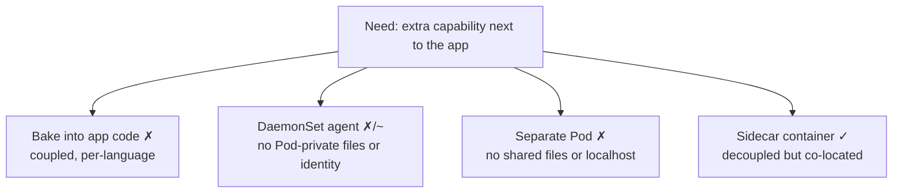
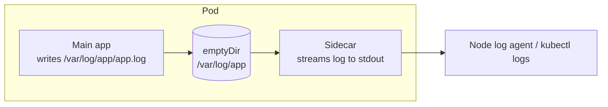

# Kubernetes Sidecar Container — Domain 2: Workloads & Scheduling

> **One-line idea:** A sidecar is a helper container that runs next to your main app in the same Pod and adds a capability (logging, proxying, config refresh) **without changing the app's code or image**.

> **Quick recap (multi-container Pod):** containers in one Pod share the **network** (same IP, talk on `localhost`), any **volume** you mount in both, and the **node/lifecycle**. They do **not** share filesystems, and each has its own image and resource limits.

---

## 1. The Problem — Why Sidecars Exist

Almost every service needs the same "extras": ship logs, secure traffic, refresh config or secrets, sync content. How do you add them?

| Approach | Why it hurts |
| --- | --- |
| **Build it into the app** (library/code) | One implementation per language. Every change = rebuild + redeploy the app. Impossible for third-party or legacy apps. |
| **Node-level agent** (DaemonSet) | Great for stdout logs, but it can't read a Pod's private files, has no per-Pod config or identity, and **DaemonSets don't run on EKS Fargate**. |
| **Separate Pod** | No shared files, no `localhost`, may land on another node. |
| ✅ **Sidecar** | Own image and release cycle, shares the Pod's files and network, scales 1:1 with the app. |



---

## 2. What Is a Sidecar?

A sidecar is just **another container in the same Pod** whose job is to support the main container. Kubernetes has no special "sidecar object" for the classic style — you simply add a second item under `spec.containers`.



> 💡 A newer way to declare a sidecar (`restartPolicy: Always` on an init container) fixes startup/shutdown ordering. That is covered in the **Native Sidecar** notes. This file covers the idea and the classic style.

---

## 3. When to Use It (and When Not To)

**Use a sidecar when the helper:**

- needs the Pod's **files** or **`localhost`** network,
- must run **one per Pod** and scale with it,
- should have its **own image and release cycle**,
- must work **without touching app code** (legacy, third-party, polyglot).

**Don't use a sidecar when:**

- the job is **node-level** (collect stdout from every Pod, node metrics) → use a **DaemonSet**.
- the helper is an **independent service** that other Pods also use → separate Deployment + Service.
- the helper is **heavy** — its cost is multiplied by every replica.

### Sidecar vs DaemonSet (a favourite interview topic)

| | Sidecar | DaemonSet agent |
| --- | --- | --- |
| Runs | One per **Pod** | One per **node** |
| Sees Pod-private files / localhost | ✅ Yes | ❌ No (only node paths) |
| Per-app config | ✅ Easy | Harder (shared config) |
| Resource cost | Per replica (adds up fast) | Per node (cheap) |
| Works on EKS Fargate | ✅ Yes | ❌ No |
| Best for | App-specific needs, file logs, proxies | Cluster-wide stdout logs, node metrics |

> **Rule of thumb:** If the app logs to **stdout**, use a node-level DaemonSet agent. If it writes **files** you can't change, use a sidecar.

---

## 4. Real Use Cases

| Use case | Sidecar does | Example |
| --- | --- | --- |
| **Log streaming** | Tails a log file and prints it to stdout so `kubectl logs` and node agents can see it | `busybox tail -F` |
| **Log shipping** | Reads files and sends them to a backend | Fluent Bit sidecar |
| **Service mesh proxy** | Handles mTLS, routing, retries, telemetry for all traffic | Envoy / Istio proxy |
| **Config reload** | Watches a ConfigMap/file and tells the app to reload | `prometheus-config-reloader` |
| **Content / Git sync** | Keeps files in a shared volume up to date | `git-sync` |
| **Secrets agent** | Fetches and renews secrets into a shared volume | Vault Agent |
| **Telemetry collector** | Receives traces/metrics from the app on `localhost` and forwards them | OpenTelemetry Collector (sidecar mode) |

---

## 5. Implementation

A classic sidecar = a second container in `spec.containers` + a shared volume (when files are involved).

**Scenario:** `nginx` writes its access log. We mount an `emptyDir` over `/var/log/nginx` so real log files are written, and a sidecar streams them to its own stdout.

```yaml
apiVersion: v1
kind: Pod
metadata:
  name: sidecar-demo
spec:
  volumes:
    - name: nginx-logs
      emptyDir: {}                          # shared scratch space
  containers:
    - name: web                             # main app
      image: nginx
      volumeMounts:
        - name: nginx-logs
          mountPath: /var/log/nginx         # app writes logs here
    - name: log-sidecar                     # the sidecar
      image: busybox
      command: ["sh", "-c", "tail -F /var/log/nginx/access.log"]
      volumeMounts:
        - name: nginx-logs
          mountPath: /var/log/nginx         # sidecar reads the same files
```

**Three things to remember:**

1. The volume is defined once under `spec.volumes` and **mounted in both containers**.
2. `tail -F` (capital F) keeps retrying if the file doesn't exist yet — important because containers start in no fixed order.
3. By default the `nginx` image symlinks its logs to stdout. Mounting a volume over `/var/log/nginx` hides those symlinks, so nginx writes real files.

---

## 6. What a Senior DevOps Engineer Should Know

- **Cost multiplies by replicas.** A sidecar asking for `50m` CPU and `64Mi` memory, across 1,000 Pods, reserves about **50 vCPU and ~62 GiB** doing nothing for your business logic. Right-size sidecars and ask whether a DaemonSet would do.
- **Sidecars are often injected, not written by you.** Istio, Vault, and OpenTelemetry use a **mutating admission webhook** to add containers to your Pod at creation. The live Pod (`kubectl get pod -o yaml`) will contain containers that are **not in your Deployment YAML**. They also count against `ResourceQuota`.
- **Identity is shared at Pod level.** On EKS, IRSA / Pod Identity gives credentials to the **ServiceAccount**, so the app *and* every sidecar get the **same IAM role**. You cannot give a sidecar a different role.
- **`emptyDir` lives on node disk.** Logs written there count against the Pod's ephemeral storage. Nothing rotates them. Set `sizeLimit` (and ephemeral-storage limits), or a chatty app can fill the disk and get the Pod **evicted**.
- **Start and stop order is not guaranteed** for classic sidecars. The app may start before its proxy is ready, the proxy may die before the app finishes draining, and in a **Job** the sidecar keeps running so the Job never completes. All three are fixed by **native sidecars**.
- **Each container has its own probes and limits.** A Pod is `Ready` only when **all** containers are ready, so a failing sidecar can take the whole Pod out of the Service. Set limits so a runaway sidecar can't starve the app.
- **Security:** all containers share one network namespace, so a compromised sidecar can reach anything the app can on `localhost`. Give each container its own least-privilege `securityContext`.
- **EKS Fargate:** no DaemonSets, so agents (logging, monitoring, OTel) usually run as sidecars.

---

## 7. Common Mistakes & Troubleshooting

| Symptom / Mistake | Cause | Fix |
| --- | --- | --- |
| Sidecar logs are empty | `mountPath` differs, or volume not mounted in both containers | Make paths line up; check `volumeMounts` on both |
| Sidecar crashes at start with "file not found" | App hasn't created the file yet | Use `tail -F` or a retry loop |
| `READY 1/2` | One container failing / not ready | `kubectl describe pod`, then `kubectl logs <pod> -c <name>` |
| Job never completes | Sidecar keeps running after the main task ends | Use a native sidecar |
| Pod evicted for disk | `emptyDir` full of logs | Set `sizeLimit`, rotate, or ship and delete |
| "Where did this container come from?" | Injected by a mutating webhook | `kubectl get pod -o yaml`, check webhook configs |
| Using a sidecar for cluster-wide stdout logs | Wrong tool | Use a DaemonSet |

---

## 8. Hands-on Labs

### Lab 1 — Streaming Sidecar

```
kubectl apply -f sidecar-demo.yaml            # manifest from Section 5
kubectl get pods                              # READY 2/2

# Generate a request (from the sidecar, over localhost)
kubectl exec sidecar-demo -c log-sidecar -- wget -q -O- http://localhost

# See nginx's access log through the sidecar
kubectl logs sidecar-demo -c log-sidecar
```

**Expected outcome:** A line like `127.0.0.1 - - [...] "GET / HTTP/1.1" 200`. The app was never modified.

### Lab 2 — A Sidecar Crash Doesn't Kill the App

```yaml
apiVersion: v1
kind: Pod
metadata:
  name: crash-demo
spec:
  containers:
    - name: app
      image: busybox
      command: ["sh", "-c", "while true; do echo app alive; sleep 5; done"]
    - name: flaky-sidecar
      image: busybox
      command: ["sh", "-c", "sleep 15; exit 1"]    # crashes every 15s
```

```
kubectl apply -f crash-demo.yaml
kubectl get pod crash-demo -w                      # READY flips 2/2 → 1/2, sidecar RESTARTS grows

kubectl get pod crash-demo -o jsonpath='{range .status.containerStatuses[*]}{.name}{" restarts="}{.restartCount}{"\n"}{end}'
kubectl logs crash-demo -c app --tail=3            # app keeps logging
```

**Expected outcome:** Only `flaky-sidecar` restarts (and eventually shows `CrashLoopBackOff`). `app` has `restarts=0`. Each container restarts on its own, but the Pod is `NotReady` while the sidecar is down.

> Clean up: `kubectl delete pod sidecar-demo crash-demo`

---

## 9. Practice Exercises (Try Without Looking)

### Exercise 1 — Add a Sidecar to an Existing Deployment (CKA style)

**Task:** A Deployment `web` runs `nginx`. Add a sidecar container `log-sidecar` (image `busybox`) that runs `tail -F /var/log/nginx/access.log`. Both containers must share an `emptyDir` at `/var/log/nginx`.

<details>
<summary>Solution</summary>

```
kubectl create deployment web --image=nginx --dry-run=client -o yaml > web.yaml
# edit web.yaml (or: kubectl edit deploy web)
```

```yaml
    spec:
      volumes:
        - name: nginx-logs
          emptyDir: {}
      containers:
        - name: nginx
          image: nginx
          volumeMounts:
            - name: nginx-logs
              mountPath: /var/log/nginx
        - name: log-sidecar
          image: busybox
          command: ["sh", "-c", "tail -F /var/log/nginx/access.log"]
          volumeMounts:
            - name: nginx-logs
              mountPath: /var/log/nginx
```

```
kubectl apply -f web.yaml
kubectl rollout status deploy/web
kubectl get pods                    # READY 2/2
```
</details>

### Exercise 2 — Why Are the Sidecar Logs Empty?

**Task:** The sidecar prints nothing. Find and fix the bug.

```yaml
apiVersion: v1
kind: Pod
metadata:
  name: broken-sidecar
spec:
  volumes:
    - name: logs
      emptyDir: {}
  containers:
    - name: app
      image: busybox
      command: ["sh", "-c", "mkdir -p /var/log/app; while true; do date >> /var/log/app/app.log; sleep 3; done"]
      volumeMounts:
        - name: logs
          mountPath: /var/log/app
    - name: sidecar
      image: busybox
      command: ["sh", "-c", "tail -F /var/log/app/app.log"]
      volumeMounts:
        - name: logs
          mountPath: /var/log
```

<details>
<summary>Solution</summary>

The sidecar mounts the volume at `/var/log`, so the file appears at `/var/log/app.log`, not `/var/log/app/app.log`. `tail -F` quietly waits for a file that never appears. Fix: mount at `/var/log/app` in both containers.

```yaml
      volumeMounts:
        - name: logs
          mountPath: /var/log/app
```
</details>

### Exercise 3 — Pick the Right Tool (No Cluster Needed)

**Task:** Sidecar, DaemonSet, or something else?

1. Apps log JSON to stdout; you want all logs in one central system.
2. A legacy app writes to `/var/log/app/*.log` and you can't change it.
3. All services need mTLS without any code changes.
4. Pods on EKS Fargate need to run the CloudWatch / OpenTelemetry agent.

<details>
<summary>Solution</summary>

1. **DaemonSet** log agent (stdout is visible at node level, cheapest option).
2. **Sidecar** (streaming or shipping) — it needs the Pod's files.
3. **Service mesh sidecar** (or a sidecar-less mesh mode).
4. **Sidecar** — Fargate does not support DaemonSets.
</details>

---

## 10. Interview Questions (Basic → Advanced)

**Basic**

1. **What is a sidecar container?** — A helper container in the same Pod as the main app that adds a capability (logging, proxy, config sync) without changing the app.
2. **Why not put that logic inside the app image?** — It couples release cycles, needs per-language code, and is impossible for third-party or legacy apps.
3. **How do the app and sidecar share files?** — A volume (e.g. `emptyDir`) defined once and mounted in both containers.
4. **How do they communicate?** — Over `localhost`, since they share one network namespace.

**Intermediate**

5. **Sidecar vs DaemonSet for logging — how do you choose?** — Stdout logs → DaemonSet (one agent per node, cheap). File logs or Pod-specific needs → sidecar. Fargate has no DaemonSets, so sidecar.
6. **One container in the Pod crashes — what happens?** — Only that container restarts. The Pod stays but is `NotReady` while any container is not ready.
7. **How do injected sidecars (Istio, Vault) end up in my Pod?** — A mutating admission webhook adds them at Pod creation, so they appear in the live Pod but not in your Deployment YAML.
8. **What is the cost concern with sidecars?** — Their requests and limits are repeated for every replica, so small sidecars add up to a lot of CPU/memory cluster-wide.
9. **Can the sidecar have different IAM permissions than the app on EKS?** — No. IRSA / Pod Identity is tied to the Pod's ServiceAccount, so all containers share the same role.

**Advanced**

10. **What are the problems with classic sidecars?** — No start order (app may start before the proxy), no stop order (proxy may exit before the app drains), and Jobs never complete because the sidecar keeps running. Native sidecars solve all three.
11. **A Pod with a log sidecar gets evicted. Why?** — `emptyDir` uses node disk and counts as ephemeral storage. Unrotated logs fill it. Set `sizeLimit` and rotate or ship logs out.
12. **A sidecar is OOM-killed repeatedly — what is the impact?** — Only that container restarts, but the Pod goes `NotReady` and the app may lose a needed function (e.g. its proxy). Set sensible limits and probes.
13. **Is a sidecar always the right pattern for observability?** — No. Prefer node-level agents for stdout and metrics, and use sidecars only when you need Pod-private access. Cost and operational overhead grow with Pod count.

---

## 11. Summary — Key Points to Remember

- A sidecar is **a helper container in the same Pod** that adds a feature without changing the app.
- **Why:** decoupled release cycle + shared files and `localhost` + scales 1:1 with the app.
- **How:** second item in `spec.containers` + a shared volume mounted in both.
- **Use** for Pod-private needs (file logs, mesh proxy, secrets agent, config reload). **Don't use** for node-level jobs (DaemonSet) or independent services.
- **Senior points:** cost × replicas, injection via webhooks, shared IAM identity, `emptyDir` fills disk, no start/stop order in the classic style.
- Classic ordering problems are solved by **native sidecars** (next notes).

---

*Related notes:* Adapter · Ambassador · Init Containers · Native Sidecar
