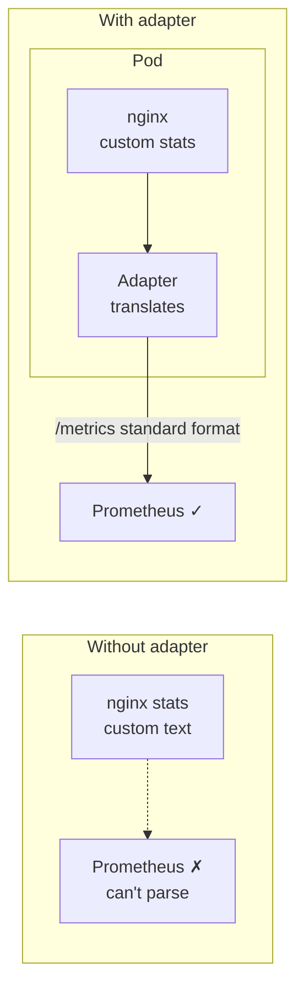
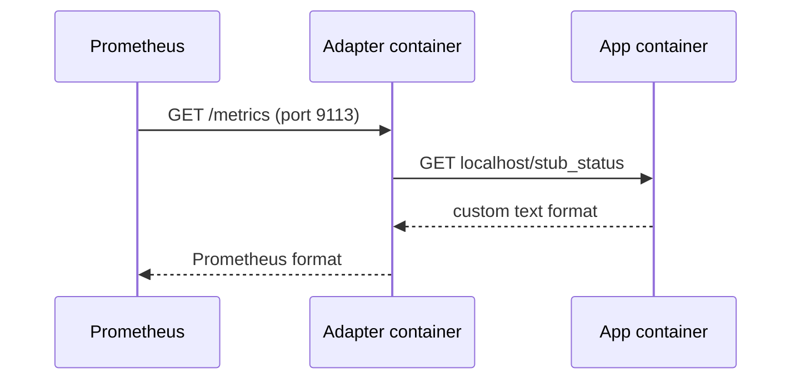
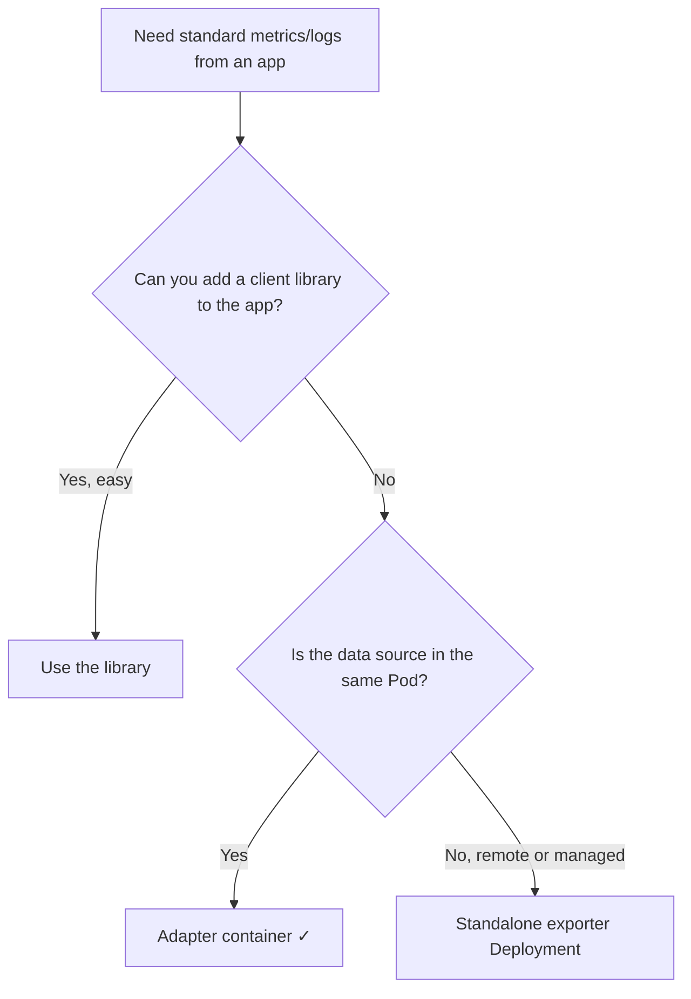

# Kubernetes Adapter Container — Domain 2: Workloads & Scheduling

> **One-line idea:** An adapter is a helper container that sits next to your app and **converts the app's output into a standard format** that other systems (Prometheus, log pipelines) already understand — without changing the app.

> **Quick recap (multi-container Pod):** containers in one Pod share the **network** (same IP, `localhost`), any **volume** you mount in both, and the **node/lifecycle**. Each keeps its own image, filesystem, and resource limits.

---

## 1. The Problem — Why Adapters Exist

Your platform expects **one standard format**. Prometheus wants `/metrics` in its text format. The log pipeline wants JSON. But your workloads are a mix:

- A legacy app that reports status in its own plain-text format.
- Third-party software (nginx, Redis, MySQL) that exposes stats its own way.
- Apps written by different teams, each logging differently.

**Options:**

| Option | Problem |
| --- | --- |
| Modify every app to speak the standard format | Impossible for third-party/legacy. Expensive and slow for the rest. |
| Teach the monitoring system every format | Monitoring stack becomes a pile of custom parsers. |
| ✅ **Adapter container** | One small translator per Pod. App untouched, platform sees one standard. |



---

## 2. What Is an Adapter?

An adapter is a **sidecar whose only job is translation**. It:

1. **Reads** the app's data (over `localhost`, or from a shared file).
2. **Converts** it to the standard format.
3. **Exposes** it where the platform expects it (e.g. HTTP port with `/metrics`).



> 💡 **Sidecar vs Adapter:** a sidecar *adds a capability*. An adapter *changes the format of what already exists*. An adapter is a specific kind of sidecar.

---

## 3. When to Use It (and When Not To)

| ✅ Use an adapter when | ❌ Don't when |
| --- | --- |
| App can't be changed (legacy, third-party) | You own the code and a client library is simple (e.g. Micrometer, Prometheus client) |
| Target is **in the same Pod** (reachable on `localhost` or via shared file) | Target is **remote or managed** (RDS, ElastiCache) → run a **standalone exporter Deployment** |
| You want one standard format across many apps | Metric is **node-level** (CPU, disk) → use `node-exporter` DaemonSet |
| Per-Pod metrics are needed | You only need cluster-wide aggregates |



---

## 4. Real Use Cases

| Use case | Adapter | What it translates |
| --- | --- | --- |
| nginx metrics | `nginx-prometheus-exporter` | `stub_status` text → Prometheus metrics (port 9113) |
| Redis metrics | `redis_exporter` | Redis `INFO` output → Prometheus metrics (port 9121) |
| MySQL metrics | `mysqld_exporter` | MySQL status → Prometheus metrics (port 9104) |
| StatsD apps | `statsd_exporter` | StatsD UDP metrics → Prometheus metrics |
| Mixed log formats | Fluent Bit sidecar | Different app log formats → one JSON schema |
| Telemetry normalisation | OpenTelemetry Collector (sidecar) | Different telemetry protocols → OTLP |

---

## 5. Implementation

**Scenario:** `nginx` exposes request stats at `/stub_status` in nginx's own text format. We add the official exporter as an adapter so Prometheus can scrape `:9113/metrics`.

```yaml
apiVersion: v1
kind: ConfigMap
metadata:
  name: nginx-status-conf
data:
  default.conf: |
    server {
      listen 80;
      location / {
        root /usr/share/nginx/html;
        index index.html;
      }
      location /stub_status {
        stub_status;                       # nginx's built-in stats page
      }
    }
---
apiVersion: v1
kind: Pod
metadata:
  name: nginx-adapter
  labels:
    app: nginx-adapter
spec:
  volumes:
    - name: conf
      configMap:
        name: nginx-status-conf
  containers:
    - name: nginx                          # main app
      image: nginx
      ports:
        - name: http
          containerPort: 80
      volumeMounts:
        - name: conf
          mountPath: /etc/nginx/conf.d
    - name: exporter                       # the adapter
      image: nginx/nginx-prometheus-exporter:1.3.0     # any current tag works
      args: ["--nginx.scrape-uri=http://localhost:80/stub_status"]
      ports:
        - name: metrics                    # named port so Prometheus can target it
          containerPort: 9113
```

**Three things to remember:**

1. The adapter reaches the app through **`localhost`** — shared network.
2. It listens on a **different port** (9113) from the app (80). Two containers can't share a port.
3. Give the metrics port a **name** (`metrics`). A `PodMonitor` (Prometheus Operator) selects the port by name.

**How Prometheus finds it (Prometheus Operator):**

```yaml
apiVersion: monitoring.coreos.com/v1
kind: PodMonitor
metadata:
  name: nginx-adapter
spec:
  selector:
    matchLabels:
      app: nginx-adapter
  podMetricsEndpoints:
    - port: metrics
```

---

## 6. What a Senior DevOps Engineer Should Know

- **Adapter vs standalone exporter:** if the target is **remote or managed** (RDS, ElastiCache, MSK), don't add an adapter to every app Pod. Run **one exporter Deployment** that connects over the network. An adapter is right only when the data is reachable **inside the Pod**.
- **Per-Pod metrics = per-Pod cost.** 500 replicas = 500 exporters = 500 more scrape targets. Watch Prometheus **cardinality** and memory.
- **Expose only what's needed.** The metrics port is reachable by anything that can reach the Pod. Restrict with a **NetworkPolicy** (allow only Prometheus).
- **Use named ports.** `PodMonitor` / `ServiceMonitor` select by port name, so numbers can change without breaking monitoring.
- **Adapter health matters.** If the exporter dies, the app still serves traffic but **you lose visibility**. Alert on `up == 0` and on the exporter's own "app reachable" metric (for example `nginx_up`).
- **Pod `Ready` includes the adapter.** A crashing exporter makes the Pod `NotReady` and removes it from the Service. Don't make a monitoring helper able to cause an outage: decide deliberately about its readiness behaviour.
- **OpenTelemetry Collector** is increasingly used to replace many one-off adapters: one collector handles multiple input formats.
- **Alternative to adapter:** instrument the app (Prometheus client or OTel SDK). Best when you own the code. Adapters are for when you don't.

---

## 7. Common Mistakes & Troubleshooting

| Symptom / Mistake | Cause | Fix |
| --- | --- | --- |
| `nginx_up 0` | Adapter can't reach `stub_status` (wrong URI/port, or location not enabled) | Check `--nginx.scrape-uri` and the nginx config |
| Prometheus doesn't scrape the Pod | Port has no name, or `PodMonitor` labels don't match | Name the port; match labels |
| Adapter crashes: "address already in use" | Same port as the app | Use a different port |
| Adapter can't see app's file | Volume not shared / wrong `mountPath` | Mount the same volume in both |
| Adding an adapter for RDS metrics in every Pod | Wrong pattern | One standalone exporter Deployment |
| Metrics port open to the whole cluster | No NetworkPolicy | Restrict to Prometheus |

---

## 8. Hands-on Labs

### Lab 1 — Real Adapter: nginx → Prometheus Metrics

```
kubectl apply -f nginx-adapter.yaml             # ConfigMap + Pod from Section 5
kubectl get pods                                 # READY 2/2

# 1. See the app's RAW format
kubectl port-forward pod/nginx-adapter 8080:80 &
curl -s localhost:8080/stub_status
kill %1

# 2. See the ADAPTED (Prometheus) format
kubectl port-forward pod/nginx-adapter 9113:9113 &
curl -s localhost:9113/metrics | grep '^nginx_'
kill %1
```

**Expected outcome:** Step 1 shows nginx's plain text (`Active connections: 1 ...`). Step 2 shows Prometheus metrics such as `nginx_up 1` and `nginx_connections_active`. Same data, two formats, and nginx was never changed.

### Lab 2 — Build a Tiny Adapter Yourself (No Internet Needed)

```yaml
apiVersion: v1
kind: Pod
metadata:
  name: adapter-demo
spec:
  volumes:
    - name: data
      emptyDir: {}
  containers:
    - name: app                              # writes a custom format: "requests=5 errors=0"
      image: busybox
      command: ["sh", "-c"]
      args:
        - |
          i=0
          while true; do
            i=$((i+1))
            echo "requests=$i errors=0" > /data/status.txt
            sleep 3
          done
      volumeMounts:
        - name: data
          mountPath: /data
    - name: adapter                          # converts it to Prometheus format
      image: busybox
      command: ["sh", "-c"]
      args:
        - |
          while true; do
            if [ -f /data/status.txt ]; then
              awk -F'[= ]' '{print "app_requests_total " $2; print "app_errors_total " $4}' /data/status.txt > /data/metrics.txt
            fi
            sleep 3
          done
      volumeMounts:
        - name: data
          mountPath: /data
```

```
kubectl apply -f adapter-demo.yaml
kubectl exec adapter-demo -c app -- cat /data/status.txt        # custom format
kubectl exec adapter-demo -c adapter -- cat /data/metrics.txt   # standard format
```

**Expected outcome:** `requests=7 errors=0` becomes `app_requests_total 7` and `app_errors_total 0`. A real adapter serves this over HTTP at `/metrics`; the file keeps the lab simple.

> Clean up: `kubectl delete pod nginx-adapter adapter-demo` and `kubectl delete cm nginx-status-conf`

---

## 9. Practice Exercises (Try Without Looking)

### Exercise 1 — Add an Exporter to an Existing Pod

**Task:** You have the `nginx-adapter` Pod running **without** the exporter (only `nginx` + the ConfigMap). Add the exporter container so port `9113` serves metrics, and name the port `metrics`.

<details>
<summary>Solution</summary>

Pods can't have containers added in place, so edit the Pod YAML, delete and recreate (or edit the Deployment template).

```yaml
    - name: exporter
      image: nginx/nginx-prometheus-exporter:1.3.0
      args: ["--nginx.scrape-uri=http://localhost:80/stub_status"]
      ports:
        - name: metrics
          containerPort: 9113
```

```
kubectl delete pod nginx-adapter && kubectl apply -f nginx-adapter.yaml
kubectl port-forward pod/nginx-adapter 9113:9113 &
curl -s localhost:9113/metrics | grep nginx_up       # nginx_up 1
```
</details>

### Exercise 2 — `nginx_up 0`

**Task:** The exporter works but reports `nginx_up 0`. The exporter is started with `--nginx.scrape-uri=http://localhost:8080/stub_status`, and nginx listens on port 80. Fix it.

<details>
<summary>Solution</summary>

The adapter is calling the wrong port. Both containers share `localhost`, so the URI must match the app's port.

```yaml
      args: ["--nginx.scrape-uri=http://localhost:80/stub_status"]
```

Diagnose with `kubectl logs nginx-adapter -c exporter` (connection refused on 8080).
</details>

### Exercise 3 — Adapter, Library, or Standalone Exporter? (No Cluster Needed)

**Task:** Choose the best approach.

1. A legacy binary exposes its status as plain text on `localhost:9000`.
2. You need Postgres metrics for an Amazon RDS instance.
3. Your team's Spring Boot service needs Prometheus metrics.
4. You need CPU and disk metrics for every node.

<details>
<summary>Solution</summary>

1. **Adapter** — data is in the Pod, app can't change.
2. **Standalone exporter Deployment** — the database is remote, one exporter is enough.
3. **Client library** (Micrometer) — you own the code.
4. **`node-exporter` DaemonSet** — node-level metrics.
</details>

---

## 10. Interview Questions (Basic → Advanced)

**Basic**

1. **What is an adapter container?** — A helper container that converts the app's output into a standard format, without modifying the app.
2. **Give a real example.** — `nginx-prometheus-exporter` reading `stub_status` and serving Prometheus metrics on `:9113`.
3. **How does the adapter reach the app?** — Over `localhost` (shared network) or through a shared volume.

**Intermediate**

4. **Adapter vs sidecar?** — Both are extra containers. A sidecar adds a capability; an adapter specifically translates formats.
5. **Why must the adapter use a different port than the app?** — They share one network namespace; two containers can't listen on the same port.
6. **How does Prometheus discover the adapter's endpoint?** — Via a `PodMonitor` / `ServiceMonitor` that selects Pods by label and the metrics port by name.
7. **When is an adapter the wrong choice?** — When the data source is remote or managed (use a standalone exporter), when you own the code (use a library), or for node-level metrics (DaemonSet).

**Advanced**

8. **You run 800 replicas, each with an exporter sidecar. What problems might you see?** — Scrape target count and metric cardinality rise, Prometheus memory grows, and the sidecars add CPU/memory cost per replica. Consider aggregation, fewer or lighter exporters, or an OTel Collector.
9. **A broken exporter causes an outage — how?** — The Pod is `Ready` only when all containers are ready. If the exporter fails its readiness check, the Pod is removed from the Service. Decide whether a monitoring helper should affect traffic and configure probes accordingly.
10. **How would you secure the metrics endpoint?** — Use a NetworkPolicy to allow only the Prometheus namespace/Pods to reach the metrics port, and expose only the port you need.
11. **How would you replace many one-off adapters?** — An OpenTelemetry Collector (sidecar or gateway) that accepts many input formats and exports a standard one.

---

## 11. Summary — Key Points to Remember

- An adapter is a **sidecar that translates**: app's format → standard format.
- **Why:** you can't change legacy/third-party apps, and you want one standard for the platform.
- **How:** second container reads via `localhost` or a shared file, converts, and exposes it on **its own port**.
- **Use** when the data source is **in the Pod**. Use a **standalone exporter** for remote targets, a **library** when you own the code, a **DaemonSet** for node metrics.
- **Senior points:** per-Pod cost and cardinality, name the metrics port, restrict with NetworkPolicy, adapter health can affect Pod readiness, OTel Collector can replace many adapters.

---

*Related notes:* Sidecar · Ambassador · Init Containers · Native Sidecar
