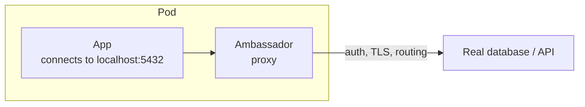
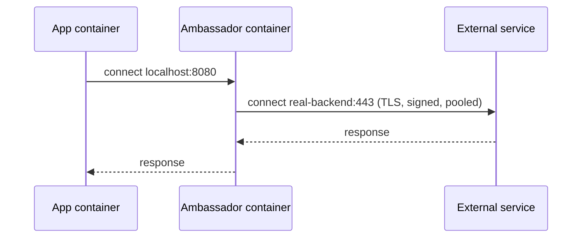

# Kubernetes Ambassador Container — Domain 2: Workloads & Scheduling

> **One-line idea:** An ambassador is a helper container that acts as a **local proxy for your app's outbound connections**. The app just talks to `localhost`; the ambassador handles the hard parts of reaching the outside world (which backend, auth, TLS, pooling).

> **Quick recap (multi-container Pod):** containers in one Pod share the **network** (same IP, `localhost`), any **volume** you mount in both, and the **node/lifecycle**. Each keeps its own image, filesystem, and resource limits.

---

## 1. The Problem — Why Ambassadors Exist

Your app has to call something outside the Pod: a database, a cache, an AWS API. The connection is rarely simple:

- **Which** backend? (dev vs prod, primary vs replica, shard 1 vs shard 2)
- **Authentication:** requests to some AWS APIs must be signed (SigV4); some databases need a special auth proxy.
- **TLS, retries, connection pooling** — needed, but nobody wants to code them into every app.
- A **legacy app** has `localhost:5432` hard-coded and can't be changed.

| Option | Problem |
| --- | --- |
| Put routing/auth/retry logic in every app | Duplicated per language, hard to change, impossible for legacy |
| Use a Kubernetes **Service** only | A Service gives L4 load balancing by DNS. It doesn't sign requests, pool connections, pick shards, or add TLS to a plain-text client |
| ✅ **Ambassador container** | App keeps a trivial config (`localhost:port`). The ambassador does the work |



---

## 2. What Is an Ambassador?

An ambassador is a **sidecar that proxies outbound traffic**. It:

1. **Listens** on a local port (`localhost:<port>`).
2. **Receives** the app's plain connection.
3. **Forwards** it to the real destination, adding whatever is needed on the way (routing, auth, TLS).



> 💡 **Sidecar vs Adapter vs Ambassador:**
> Sidecar = *adds a capability* · Adapter = *changes the format of the app's output* · Ambassador = *handles the app's outbound connections*.

---

## 3. When to Use It (and When Not To)

| ✅ Use an ambassador when | ❌ Don't when |
| --- | --- |
| App can't be changed but must reach a complex backend | A plain Kubernetes Service is enough (simple HTTP to another service) |
| Requests need **signing / special auth** (e.g. AWS SigV4) | You need **transparent**, no-config interception for every service → use a **service mesh** |
| You want **environment-specific routing** hidden from the app | The proxy should be **shared** by many Pods → run it as its own Deployment |
| You want per-Pod connection handling (pooling, retries) | You don't want a proxy cost on every replica |

### Why not just use a Service?

| | Kubernetes Service | Ambassador |
| --- | --- | --- |
| Works at | L4 (IP/port), via kube-proxy | Whatever the proxy supports (L4/L7) |
| Can sign requests, add TLS, pool, shard | ❌ | ✅ |
| Needs app change | App uses the Service DNS name | App uses `localhost` (so no code change, only config) |
| Scope | Whole cluster | One Pod |

---

## 4. Real Use Cases

| Use case | Ambassador | What it does |
| --- | --- | --- |
| **AWS IAM-signed requests** | `aws-sigv4-proxy` | App sends plain HTTP to `localhost`, proxy signs with SigV4 and forwards to AWS (e.g. Amazon Managed Prometheus, OpenSearch, API Gateway) |
| **Secure DB access** | Cloud SQL Auth Proxy (GCP) | App connects to `localhost:5432`; proxy handles IAM auth + TLS to the DB |
| **Connection pooling** | PgBouncer sidecar | App connects to local pooler; pooler keeps a few connections to Postgres |
| **Env-specific routing** | Envoy / HAProxy / socat | App always talks to `localhost`; proxy points to dev/test/prod backend |
| **Sharding** | Twemproxy / custom proxy | App sees one Redis on `localhost`; proxy picks the right shard |

---

## 5. Implementation

**Scenario:** The app only knows `localhost:8080`. The ambassador forwards that to a backend Service named `backend`, using `socat` (a simple TCP forwarder).

```
# Backend and its Service (the "outside world")
kubectl run backend --image=nginx --port=80
kubectl expose pod backend --port=80
```

```yaml
apiVersion: v1
kind: Pod
metadata:
  name: ambassador-demo
spec:
  containers:
    - name: app                               # knows only localhost:8080
      image: busybox
      command: ["sh", "-c", "while true; do wget -q -O- http://localhost:8080 | head -n 1; sleep 5; done"]
    - name: ambassador                        # forwards localhost:8080 → backend:80
      image: alpine/socat
      env:
        - name: TARGET
          value: "backend:80"                 # change this, not the app
      command: ["sh", "-c", "socat TCP-LISTEN:8080,fork,reuseaddr TCP:$TARGET"]
```

**Three things to remember:**

1. The **app config never changes** — always `localhost:8080`.
2. All routing knowledge lives in the ambassador (here, the `TARGET` env var).
3. The ambassador listens on a port the app doesn't use. They share one network, so no clashes.

---

## 6. What a Senior DevOps Engineer Should Know

- **Ambassador vs service mesh sidecar.** A mesh proxy (Envoy/Istio) **intercepts traffic transparently** (iptables redirect set up by an init container), so the app needs no change. An ambassador needs the app to **point to `localhost`**. Use a mesh for cluster-wide policy, an ambassador for one specific, targeted job.
- **Start order bites.** The app may start before the ambassador is listening, so its first connections fail. Make the app retry, or use a **native sidecar** (with a `startupProbe`) so the app starts only after the proxy is ready.
- **Shutdown order bites too.** If the ambassador exits before the app finishes in-flight requests, you get dropped connections. Native sidecars stop **after** the main containers.
- **IAM is Pod-level on EKS.** With IRSA / Pod Identity the ambassador (e.g. `aws-sigv4-proxy`) uses the **ServiceAccount's role**, the same one the app has. It also can't be given a *different* role from the app.
- **Connection math with per-Pod poolers.** A PgBouncer sidecar with 20 connections × 200 Pods = **4,000 DB connections**. Per-Pod pooling doesn't reduce total connections the way a **central** pooler or RDS Proxy does.
- **NetworkPolicy sees the Pod, not the container.** Egress policy applies to the Pod's outbound traffic (what the ambassador sends). The app-to-ambassador hop on `localhost` is not filtered.
- **It's one more thing to monitor.** An unhealthy ambassador means the app can't reach its backend while the app container looks perfectly healthy. Add a readiness probe on the proxy port.
- **Cost × replicas**, same as any sidecar.

---

## 7. Common Mistakes & Troubleshooting

| Symptom / Mistake | Cause | Fix |
| --- | --- | --- |
| App: "connection refused" on `localhost` | Ambassador not started yet, crashed, or listening on a different port | `kubectl logs <pod> -c ambassador`; match ports |
| App works only after a few retries on start | Start-order race | Add retries in the app, or use a native sidecar + `startupProbe` |
| Ambassador logs "could not resolve backend" | Wrong Service name / namespace | Check `TARGET` and `kubectl get svc` |
| Two containers fail to bind the same port | Shared network namespace | Give each its own port |
| Dropped requests during rollout | Ambassador stopped before the app drained | Native sidecar, or `preStop` delay |
| DB hits `max_connections` | Per-Pod pooler × replicas | Use a central pooler / RDS Proxy |
| Using an ambassador when a Service would do | Over-engineering | Use the Service |

---

## 8. Hands-on Labs

### Lab 1 — Ambassador Forwards to a Backend

```
kubectl run backend --image=nginx --port=80
kubectl expose pod backend --port=80
kubectl apply -f ambassador-demo.yaml            # manifest from Section 5
kubectl logs ambassador-demo -c app
```

**Expected outcome:** The app prints `<!DOCTYPE html>` (nginx's page), though it only ever connects to `localhost:8080`.

### Lab 2 — Change the Backend Without Touching the App

```
# 1. Create a second backend with a different response
kubectl run backend-v2 --image=httpd --port=80
kubectl expose pod backend-v2 --port=80

# 2. Point ONLY the ambassador at it
sed -i 's/backend:80/backend-v2:80/' ambassador-demo.yaml
kubectl delete pod ambassador-demo
kubectl apply -f ambassador-demo.yaml

# 3. Check the app's output
kubectl logs ambassador-demo -c app
```

**Expected outcome:** The first line changes from `<!DOCTYPE html>` (nginx) to `<html><body><h1>It works!</h1></body></html>` (Apache httpd). The app container's command and image didn't change at all.

> Clean up: `kubectl delete pod ambassador-demo backend backend-v2` and `kubectl delete svc backend backend-v2`

---

## 9. Practice Exercises (Try Without Looking)

### Exercise 1 — Build an Ambassador

**Task:** Create a Pod `amb` with an `app` container (busybox) that calls `http://localhost:9000` every 5 seconds, and an ambassador (`alpine/socat`) that forwards `localhost:9000` to the Service `backend` on port 80. Prove it with the app's logs.

<details>
<summary>Solution</summary>

```yaml
apiVersion: v1
kind: Pod
metadata:
  name: amb
spec:
  containers:
    - name: app
      image: busybox
      command: ["sh", "-c", "while true; do wget -q -O- http://localhost:9000 | head -n 1; sleep 5; done"]
    - name: ambassador
      image: alpine/socat
      command: ["sh", "-c", "socat TCP-LISTEN:9000,fork,reuseaddr TCP:backend:80"]
```

```
kubectl logs amb -c app             # <!DOCTYPE html>
```
</details>

### Exercise 2 — Fix the Broken Ambassador

**Task:** The app logs `wget: can't connect to remote host: Connection refused`. Find the bug.

```yaml
    - name: app
      image: busybox
      command: ["sh", "-c", "while true; do wget -q -O- http://localhost:8080 | head -n 1; sleep 5; done"]
    - name: ambassador
      image: alpine/socat
      command: ["sh", "-c", "socat TCP-LISTEN:9090,fork,reuseaddr TCP:backend:80"]
```

<details>
<summary>Solution</summary>

The app calls port **8080**, but the ambassador listens on **9090**. Both containers share `localhost`, so the ports must match. Change the ambassador to `TCP-LISTEN:8080`. Confirm with `kubectl logs <pod> -c ambassador` and `kubectl exec <pod> -c app -- wget -qO- localhost:8080`.
</details>

### Exercise 3 — Service, Ambassador, or Mesh? (No Cluster Needed)

**Task:** Choose the best tool.

1. A Pod calls another internal HTTP service in the same cluster.
2. A legacy app must call Amazon OpenSearch, which requires SigV4-signed requests, and the app can't sign.
3. You need mTLS and retries for traffic between **all** services, without touching any app.
4. Every Pod in a team's namespace needs the same Postgres pooler, shared by all.

<details>
<summary>Solution</summary>

1. **Kubernetes Service** — nothing more needed.
2. **Ambassador** (`aws-sigv4-proxy`) — app calls `localhost`, proxy signs.
3. **Service mesh** — transparent interception, cluster-wide policy.
4. **Central pooler Deployment** (or RDS Proxy) — one shared pool, not one per Pod.
</details>

---

## 10. Interview Questions (Basic → Advanced)

**Basic**

1. **What is an ambassador container?** — A helper container that proxies the app's outbound connections, so the app only talks to `localhost`.
2. **Why is it needed?** — To keep routing, auth, TLS and pooling out of the app, especially for legacy apps that can't be changed.
3. **How does the app talk to it?** — Over `localhost` and a port, since they share one network.

**Intermediate**

4. **Ambassador vs Kubernetes Service?** — A Service is L4 load balancing by DNS across Pods. An ambassador runs per Pod and can add signing, TLS, pooling, and sharding. A Service doesn't.
5. **Ambassador vs service mesh sidecar?** — A mesh intercepts traffic transparently with no app change; an ambassador requires the app to be pointed at `localhost`. Mesh is for cluster-wide policy; an ambassador is for a targeted job.
6. **Give a real-world example.** — `aws-sigv4-proxy` signing requests to AWS APIs; Cloud SQL Auth Proxy; a PgBouncer sidecar.
7. **How do you change the backend without touching the app?** — Change only the ambassador's config (env var, ConfigMap, args) and roll the Pod.

**Advanced**

8. **The app fails right after a Pod starts but works after a few seconds. Why?** — Start-order race: the app starts before the ambassador is listening. Fix with app retries, or a native sidecar with a `startupProbe`.
9. **Why might a per-Pod PgBouncer not fix "too many connections"?** — Total connections = pool size × replicas. Use a central pooler or RDS Proxy to cap it.
10. **On EKS, can the ambassador use a different IAM role from the app?** — No. IRSA / Pod Identity is per ServiceAccount, so all containers in the Pod share the role.
11. **How do requests get dropped during a rolling update with an ambassador?** — The ambassador may exit before the app finishes in-flight requests. Use native sidecars (they stop last) or a `preStop` delay.
12. **When would you reject an ambassador?** — When a Service suffices, when many Pods should share one proxy, or when a mesh already covers the need.

---

## 11. Summary — Key Points to Remember

- An ambassador is a **local outbound proxy** in the same Pod: the app talks to `localhost`, the ambassador reaches the real backend.
- **Why:** keep routing, auth, TLS, pooling out of the app; support legacy apps that can't change.
- **How:** second container listens on a local port and forwards; routing config lives only in the ambassador.
- **Not a Service replacement:** Service = L4 DNS load balancing; ambassador = per-Pod smart proxy. **Not a mesh:** needs the app to point to `localhost`.
- **Senior points:** start/shutdown order, per-Pod connection math, Pod-level IAM, NetworkPolicy scope, one more thing to monitor, cost × replicas.

---

*Related notes:* Sidecar · Adapter · Init Containers · Native Sidecar
