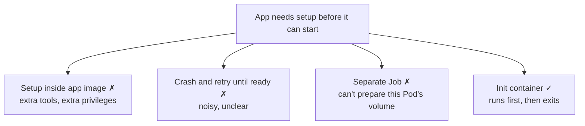
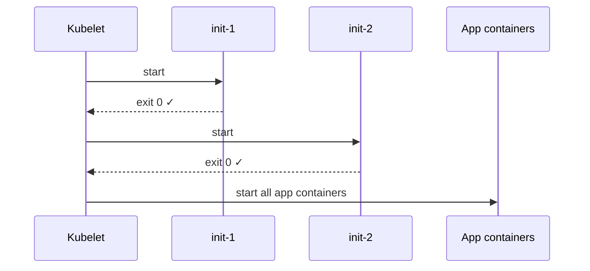
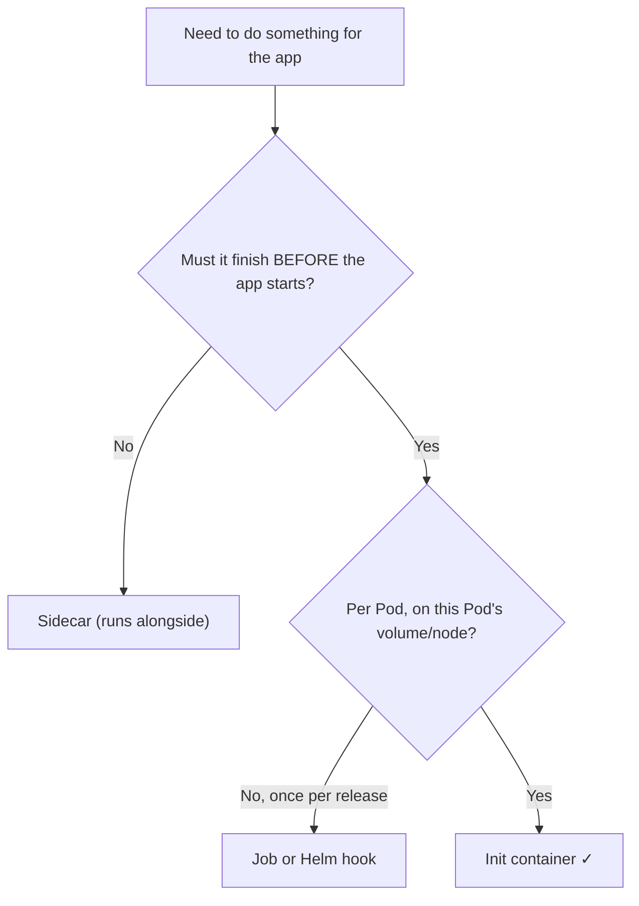
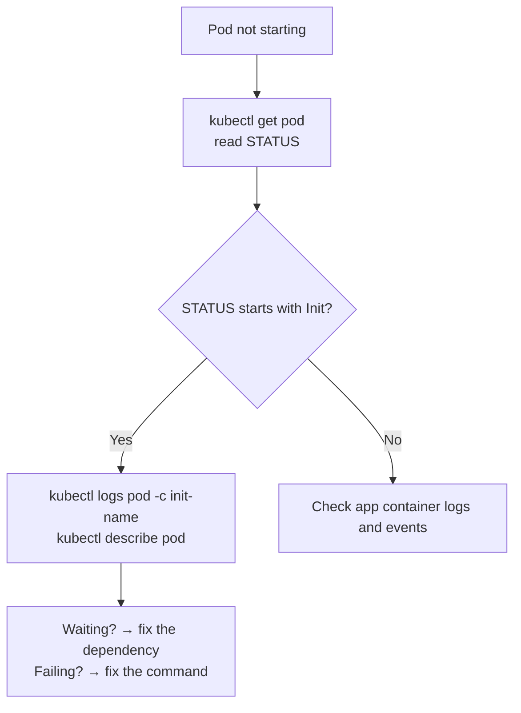

# Kubernetes Init Container — Domain 2: Workloads & Scheduling

> **One-line idea:** An init container is a container that runs **to completion, before** the app containers start. Use it for setup work that must finish first: wait for a dependency, fetch config, fix permissions, prepare data.

> **Quick recap (multi-container Pod):** containers in one Pod share the **network** (same IP, `localhost`), any **volume** you mount in both, and the **node/lifecycle**. Init containers use the same sharing, but they run **before** the app, one at a time.

---

## 1. The Problem — Why Init Containers Exist

Many apps can't start cleanly until something else is ready or prepared:

- The database or another service must be **reachable**.
- Config or secrets must be **fetched** and written to a file.
- A volume's **permissions** must be fixed (the app runs as non-root).
- Data, models, or plugins must be **downloaded** first.
- A kernel setting must be changed (e.g. Elasticsearch needs `vm.max_map_count`).

| Option | Problem |
| --- | --- |
| Put setup code in the app's startup script | Image needs extra tools (`git`, `aws-cli`, `curl`) → bigger image, bigger attack surface. App must run with the setup's (high) privileges. |
| Start the app and let it crash until ready | Noisy `CrashLoopBackOff`, confusing alerts, wasted restarts |
| Run a Kubernetes **Job** for setup | A Job runs somewhere else. It can't prepare **this Pod's** volume or node |
| ✅ **Init container** | Separate image with its own tools and privileges. Runs first, finishes, then disappears. Guaranteed order. |



---

## 2. What Is an Init Container?

Init containers are listed under **`spec.initContainers`** (separate from `spec.containers`). Rules:

- They run **one at a time, in the order listed**.
- Each must **exit successfully (code 0)** before the next one starts.
- Only after **all** finish do the app containers start.
- If one fails, the app containers **never start**.
- They share the Pod's **volumes and network**, but they are **gone** (finished) once the app is running.



**How it shows up in `kubectl get pods`:**

| STATUS | Meaning |
| --- | --- |
| `Init:0/2` | 0 of 2 init containers finished (first one running) |
| `Init:1/2` | First finished, second running |
| `Init:Error` / `Init:CrashLoopBackOff` | An init container is failing |
| `PodInitializing` | All init done, app containers starting |
| `Running` | App is up |

| | Init container | App container |
| --- | --- | --- |
| Runs | **Before** the app | Alongside other app containers |
| Ends | **Must exit 0** | Keeps running |
| Defined in | `spec.initContainers` | `spec.containers` |
| Multiple | One at a time, in order | All start together |
| Probes (liveness/readiness/startup) | ❌ Not supported | ✅ Supported |

---

## 3. When to Use It (and When Not To)

| ✅ Use an init container when | ❌ Don't when |
| --- | --- |
| Something must **finish before** the app starts | The helper must **run alongside** the app → sidecar |
| Setup needs **different tools or privileges** than the app | The work should happen **once per release**, not per Pod (e.g. DB migrations with many replicas) → Job / Helm hook |
| Setup prepares the **Pod's own volume** | You'd just be hiding a dependency the app should handle by **retrying** |
| You want a clean, ordered startup | The work is long-running or needs to keep running |



---

## 4. Real Use Cases

| Use case | What the init container does |
| --- | --- |
| **Wait for a dependency** | Loops until a Service/DB resolves or accepts connections |
| **Fetch data/config** | Downloads from S3 (using the Pod's IRSA role) or clones a Git repo into a shared volume |
| **Render config** | Builds a config file from templates and env vars/secrets |
| **Fix volume permissions** | `chown`/`chmod` a volume, running as root, while the app runs non-root |
| **Kernel tuning** | `sysctl -w vm.max_map_count=262144` for Elasticsearch (needs privileged) |
| **Network setup for a mesh** | `istio-init` sets iptables rules (needs `NET_ADMIN`); the Istio CNI plugin can replace it to avoid privileged init |
| **Copy binaries/plugins** | Copies files from a tools image into a volume the app image doesn't have |

---

## 5. Implementation

**Scenario:** The app must not start until the Service `mydb` exists.

```yaml
apiVersion: v1
kind: Pod
metadata:
  name: app-with-init
spec:
  initContainers:                              # separate list from containers
    - name: wait-for-db
      image: busybox:1.28
      command: ["sh", "-c", "until nslookup mydb; do echo waiting for mydb; sleep 2; done"]
  containers:
    - name: app
      image: nginx
```

**Passing data from init to app** (shared volume):

```yaml
spec:
  volumes:
    - name: work
      emptyDir: {}
  initContainers:
    - name: prepare
      image: busybox
      command: ["sh", "-c", "echo ready > /work/status"]
      volumeMounts:
        - name: work
          mountPath: /work
  containers:
    - name: app
      image: busybox
      command: ["sh", "-c", "cat /work/status; sleep 3600"]
      volumeMounts:
        - name: work
          mountPath: /work
```

**Three things to remember:**

1. Init containers are in **`initContainers`**, and they run in **list order**.
2. Share results with the app through a **volume** (`emptyDir`).
3. Their names must be **unique** across both lists.

---

## 6. What a Senior DevOps Engineer Should Know

- **Effective resource requests.** The scheduler reserves, per resource:
  `max( highest single init container , sum of all app containers )`.
  A heavy init container (e.g. 2 CPU for a download) **inflates the Pod's reservation for its whole life**, even though it runs for seconds.
- **Init containers must be idempotent.** They re-run whenever the Pod is **restarted** (node reboot, Pod sandbox recreation). They do **not** re-run when only an app container crashes and restarts.
- **Failure behaviour depends on `restartPolicy`.** `Always`/`OnFailure`: a failing init container is retried with backoff. `Never`: the Pod goes to `Failed`. Either way the app never starts.
- **No probes on init containers** (liveness, readiness, startup). They exist to run to completion. If a `wait` loop hangs, nothing will kill it. Use timeouts in the script.
- **A `wait-for-it` loop with no timeout hides outages.** The Pod sits `Pending` (`Init:0/1`) forever. It's fine as a convenience, but the app should still **retry its own connections** — init waits are not a substitute for resilience.
- **DB migrations in init containers are risky with replicas.** Ten replicas = ten init containers migrating at once. Prefer a **Job / Helm pre-install hook**, or a tool with locking (Flyway/Liquibase).
- **Least privilege split.** Do the root/privileged step in the init container, run the app non-root with no extra capabilities. That's one of the best security reasons to use them.
- **Pod phase is `Pending` during init.** Scripts that assume `Pending` means "unschedulable" will misread it. HPA and Service endpoints also won't count the Pod as ready until init is done.
- **Network and mesh gotcha.** With a classic mesh sidecar, init containers can't reach the network through the proxy (it isn't running yet). Native sidecars fix this (see Native Sidecar notes).
- **`kubectl logs <pod> -c <init-name>`** works even after the init container has finished. It's the first thing to check when a Pod is stuck in `Init:*`.

---

## 7. Common Mistakes & Troubleshooting

| Symptom / Mistake | Cause | Fix |
| --- | --- | --- |
| Stuck at `Init:0/1` | Init container waiting (dependency missing, wrong name) | `kubectl logs <pod> -c <init>`; check what it waits for |
| `Init:Error` → `Init:CrashLoopBackOff` | Init command fails (exit ≠ 0) | Logs of the init container; fix command/permissions |
| App never starts but no app error | An earlier init container didn't finish | `kubectl describe pod` → Init Containers section |
| `kubectl logs <pod>` shows nothing / error | App hasn't started; init is running | Add `-c <init-name>` |
| Setup runs every Pod restart and breaks things | Init not idempotent | Make it safe to re-run |
| Pod scheduling fails with big requests | Init container's high requests inflate the Pod | Lower init requests/limits |
| Duplicate name error | Init and app container share a name | Use unique names |
| Migration conflicts across replicas | Migration in init × N replicas | Job or Helm hook; use locking |



---

## 8. Hands-on Labs

### Lab 1 — Wait for a Service

```
kubectl apply -f init.yaml                       # Pod from Section 5 (wait-for-db)
kubectl get pods                                  # STATUS: Init:0/1
kubectl logs app-with-init -c wait-for-db         # "waiting for mydb"

kubectl create service clusterip mydb --tcp=3306:3306
kubectl get pods -w                               # Init:0/1 → PodInitializing → Running
```

**Expected outcome:** The app container only starts after the Service `mydb` exists.

### Lab 2 — Init Containers Run In Order

```yaml
apiVersion: v1
kind: Pod
metadata:
  name: init-order
spec:
  volumes:
    - name: work
      emptyDir: {}
  initContainers:
    - name: step-1
      image: busybox
      command: ["sh", "-c", "echo step-1 start; sleep 5; echo one > /work/one; echo step-1 done"]
      volumeMounts:
        - name: work
          mountPath: /work
    - name: step-2
      image: busybox
      command: ["sh", "-c", "echo step-2 start; cat /work/one; sleep 5; echo step-2 done"]
      volumeMounts:
        - name: work
          mountPath: /work
  containers:
    - name: app
      image: busybox
      command: ["sh", "-c", "echo app started; sleep 3600"]
```

```
kubectl apply -f init-order.yaml
kubectl get pod init-order -w                    # Init:0/2 → Init:1/2 → PodInitializing → Running
kubectl logs init-order -c step-2                # prints "one": step-1 ran first
```

**Expected outcome:** `step-2` can read the file `step-1` wrote, proving strict order. The app starts last.

### Lab 3 — A Failing Init Container Blocks the App

```yaml
apiVersion: v1
kind: Pod
metadata:
  name: init-fail
spec:
  initContainers:
    - name: will-fail
      image: busybox
      command: ["sh", "-c", "echo failing; exit 1"]
  containers:
    - name: app
      image: nginx
```

```
kubectl apply -f init-fail.yaml
kubectl get pod init-fail -w                     # Init:Error → Init:CrashLoopBackOff
kubectl logs init-fail -c will-fail              # "failing"
kubectl describe pod init-fail | grep -A5 "Init Containers"
```

**Expected outcome:** The `nginx` container is never started; the Pod stays in `Init:*`. Try again with `restartPolicy: Never` under `spec` and watch the Pod go to `Failed` (`Init:Error`) instead of retrying.

> Clean up: `kubectl delete pod app-with-init init-order init-fail` and `kubectl delete svc mydb`

---

## 9. Practice Exercises (Try Without Looking)

### Exercise 1 — Add an Init Container to a Deployment (CKA style)

**Task:** A Deployment `web` runs `nginx`. Add an init container `setup` (busybox) that writes `<h1>Hello from init</h1>` into `/usr/share/nginx/html/index.html` using a shared `emptyDir`. Verify nginx serves it.

<details>
<summary>Solution</summary>

```yaml
    spec:
      volumes:
        - name: html
          emptyDir: {}
      initContainers:
        - name: setup
          image: busybox
          command: ["sh", "-c", "echo '<h1>Hello from init</h1>' > /html/index.html"]
          volumeMounts:
            - name: html
              mountPath: /html
      containers:
        - name: nginx
          image: nginx
          volumeMounts:
            - name: html
              mountPath: /usr/share/nginx/html
```

```
kubectl rollout status deploy/web
kubectl exec deploy/web -c nginx -- cat /usr/share/nginx/html/index.html
```
</details>

### Exercise 2 — Stuck in `Init:0/1`

**Task:** The Pod waits for `my-db` but stays at `Init:0/1`. The Service that exists is named `mydb`. Fix it.

```yaml
  initContainers:
    - name: wait-for-db
      image: busybox:1.28
      command: ["sh", "-c", "until nslookup my-db; do echo waiting for my-db; sleep 2; done"]
```

<details>
<summary>Solution</summary>

Diagnose: `kubectl logs <pod> -c wait-for-db` shows it waiting for `my-db`, and `kubectl get svc` shows `mydb`. The name doesn't match. Fix the command to use `mydb` (or create a Service named `my-db`) and recreate the Pod.
</details>

### Exercise 3 — Effective Resource Requests (No Cluster Needed)

**Task:** A Pod has these requests. What does the scheduler reserve for CPU and memory?

| Container | Type | CPU | Memory |
| --- | --- | --- | --- |
| `init-1` | init | 400m | 256Mi |
| `init-2` | init | 100m | 512Mi |
| `app-1` | app | 200m | 128Mi |
| `app-2` | app | 100m | 128Mi |

<details>
<summary>Solution</summary>

Per resource: `max(highest init, sum of app containers)`.

- **CPU:** max(400m, 100m, 200m + 100m = 300m) = **400m**
- **Memory:** max(256Mi, 512Mi, 128Mi + 128Mi = 256Mi) = **512Mi**

The init containers set the Pod's reservation, even though they run for only a short time.
</details>

---

## 10. Interview Questions (Basic → Advanced)

**Basic**

1. **What is an init container?** — A container that runs to completion before the app containers start, used for setup.
2. **How do multiple init containers run?** — One at a time, in the order listed, each must exit 0 before the next starts.
3. **What happens if an init container fails?** — The app containers don't start. The init container is retried (restartPolicy `Always`/`OnFailure`), or the Pod fails (`Never`).
4. **What does `Init:0/2` mean?** — Zero of two init containers have completed.

**Intermediate**

5. **Init container vs sidecar?** — Init runs *before* the app and must finish. A sidecar runs *alongside* the app for its whole life.
6. **How does an init container pass data to the app?** — Through a shared volume (e.g. `emptyDir`).
7. **Why use an init container instead of putting setup in the app image?** — Separate image with its own tools and privileges: smaller app image, smaller attack surface, run privileged setup but the app non-root.
8. **Do init containers support probes?** — No (liveness, readiness, startup). They must run to completion.
9. **Do init containers re-run when the app container crashes?** — No. Only when the Pod itself is restarted/recreated, so they must be idempotent.
10. **How do you see logs of an init container?** — `kubectl logs <pod> -c <init-container-name>`.

**Advanced**

11. **How does the scheduler compute a Pod's resources with init containers?** — Per resource: `max(highest init container, sum of app containers)`. A heavy init container inflates the reservation.
12. **Should you run DB migrations in an init container?** — Usually no with multiple replicas: each Pod runs it concurrently. Prefer a Job or Helm hook, or a tool with locking.
13. **Why is a "wait-for-db" init container sometimes an anti-pattern?** — It hides outages (Pod sits Pending) and the app still needs its own retry logic. It's a convenience, not resilience.
14. **How would you set a kernel parameter for Elasticsearch?** — A privileged init container running `sysctl -w vm.max_map_count=262144`, with the app container unprivileged.
15. **What is `istio-init` and how can you avoid its privileges?** — It sets iptables rules (needs `NET_ADMIN`) so traffic goes through the proxy. The Istio CNI plugin does this at the node level instead.
16. **A Pod is `Pending` with `Init:0/1` for 20 minutes. Process?** — `kubectl logs -c <init>`, then `describe pod` for events, then check what the init container waits on (Service, DNS, network policy, IAM).

---

## 11. Summary — Key Points to Remember

- An init container **runs to completion before the app starts**; they run **one by one, in order**.
- **Why:** ordered, guaranteed setup using a different image/privileges, without bloating or over-privileging the app.
- **How:** list them under `spec.initContainers`; share results through a volume.
- **Use** for waiting on dependencies, fetching config/data, fixing permissions, kernel/network setup. **Don't use** for things that run alongside the app (sidecar) or once per release (Job / Helm hook).
- **Senior points:** effective request = `max(highest init, sum of apps)`, must be idempotent, no probes, `restartPolicy` decides failure behaviour, migrations in init are risky, init waits don't replace app retries.
- **Troubleshoot:** read `STATUS` (`Init:N/M`), then `kubectl logs -c <init>`.

---

*Related notes:* Sidecar · Adapter · Ambassador · Native Sidecar
