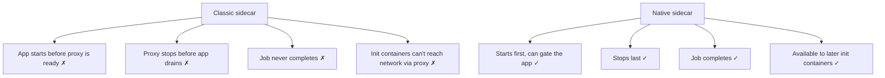
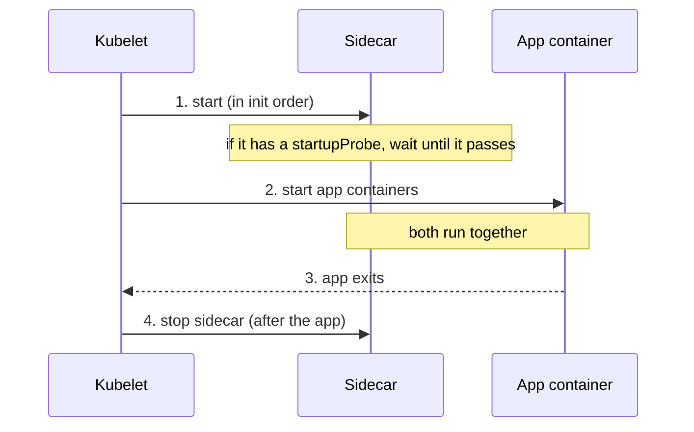

# Kubernetes Native Sidecar Containers — Domain 2: Workloads & Scheduling

> **One-line idea:** A native sidecar is an **init container with `restartPolicy: Always`**. It starts **before** the app, keeps running **alongside** it, and stops **after** it — giving sidecars the ordering that normal containers can't.

> **Quick recap:** a classic sidecar is just a second item in `spec.containers`. All containers start together with **no guaranteed order**, and the sidecar must be stopped by something else. Native sidecars fix this. (Read the **Sidecar** and **Init Container** notes first if these ideas are new.)

---

## 1. The Problem — What Was Wrong With Classic Sidecars

Classic sidecars (a normal container in `spec.containers`) have four real problems:

| Problem | What happens |
| --- | --- |
| **No start order** | The app starts before its proxy / log agent is ready. First requests fail. (Istio users know this one: the app calls out while Envoy isn't up yet.) |
| **No stop order** | On shutdown, containers stop together. The proxy can die while the app is still finishing requests, so connections drop. |
| **Jobs never finish** | The Job's main task ends, but the sidecar keeps running, so the Pod never reaches `Completed` and the Job hangs. People hacked around this (e.g. calling the proxy's `/quitquitquit`). |
| **Init containers can't use the sidecar** | An init container that needs the network through a mesh proxy fails, because the proxy hasn't started. |



---

## 2. What Is a Native Sidecar?

You declare it **under `initContainers`** and add **`restartPolicy: Always`**. That one field changes its behaviour from "run once and exit" to "start in order, then keep running".

```yaml
initContainers:
  - name: proxy
    image: my-proxy
    restartPolicy: Always        # ← this makes it a native sidecar
```

**Lifecycle:**



| Stage | Behaviour |
| --- | --- |
| **Start** | Starts in order with the init containers. The *next* init container (or the app) starts once the sidecar has **started**, or after its `startupProbe` passes if it has one |
| **Run** | Keeps running next to the app. Restarted on its own if it crashes |
| **Probes** | ✅ Supports startup, readiness and liveness (normal init containers don't) |
| **Stop** | Stopped **after** all app containers have exited |
| **Jobs** | Doesn't block the Pod/Job from completing |

> **Version:** feature gate `SidecarContainers` — alpha 1.28, beta (on by default) 1.29, **stable 1.33**. Any cluster on 1.29+ has it on; check with `kubectl version`.

---

## 3. When to Use It (and When Not To)

| ✅ Use a native sidecar when | ❌ Keep a classic container when |
| --- | --- |
| The app **needs the helper ready first** (proxy, secrets agent, DB proxy) | Order truly doesn't matter (e.g. a simple log tailer) and your tooling doesn't support it |
| The helper must **stay up until the app is done** (log shipper flushing last lines, proxy draining) | Your platform/cluster is **older than 1.29** |
| It's a **Job / CronJob** with a helper | You rely on tools that assume init containers always exit |
| An **init container needs the helper** (e.g. network via proxy) | |

> **Default advice today:** on 1.29+ use native sidecars for any helper where ordering or Jobs matter. For a throwaway log tailer, a classic container is fine.

---

## 4. Real Use Cases

| Use case | Why native is better |
| --- | --- |
| **Service mesh proxy** (Istio/Envoy) | Proxy is ready before the app sends traffic, and stays until the app drains. Istio can inject its proxy as a native sidecar |
| **Cloud DB proxy / sigv4 proxy** (ambassador) | App's first connection succeeds; no retry hack |
| **Log shipper** | Starts before the app writes, stops after the last line is written |
| **Vault Agent / secrets sidecar** | Secrets available before the app starts (gate with `startupProbe`) |
| **Jobs/CronJobs with helpers** | Job finishes normally. No `quitquitquit` hacks |
| **Init steps that need network via proxy** | Put the sidecar first in `initContainers`; later init containers can use it |

---

## 5. Implementation

**Scenario:** a sidecar that must be *ready* before the app starts. It signals readiness by creating a file, and a `startupProbe` makes Kubernetes wait for it.

```yaml
apiVersion: v1
kind: Pod
metadata:
  name: native-order
spec:
  volumes:
    - name: shared
      emptyDir: {}
  initContainers:
    - name: proxy                              # the native sidecar
      image: busybox
      restartPolicy: Always                    # ← native sidecar
      command: ["sh", "-c", "sleep 10; touch /shared/ready; sleep 3600"]
      startupProbe:                            # the app waits until this passes
        exec:
          command: ["test", "-f", "/shared/ready"]
        periodSeconds: 2
      volumeMounts:
        - name: shared
          mountPath: /shared
  containers:
    - name: app
      image: busybox
      command: ["sh", "-c", "echo app started; ls /shared; sleep 3600"]
      volumeMounts:
        - name: shared
          mountPath: /shared
```

**Migrating a classic sidecar:**

1. Move the container from `containers` to `initContainers`.
2. Add `restartPolicy: Always`.
3. Add a `startupProbe` if the app must wait for the sidecar to be *ready*, not just started.
4. Put it **first** in `initContainers` if other init containers (or the app) depend on it.

---

## 6. What a Senior DevOps Engineer Should Know

- **"Started" is not "ready".** Without a `startupProbe`, the next container starts as soon as the sidecar **starts**, not when it's actually serving. For proxies, always add a `startupProbe` (or readiness check) to gate the app.
- **Order in `initContainers` matters.** Init containers run **in order**, so a sidecar listed *after* a slow init container won't start until that one finishes. Put sidecars at the top if later steps need them.
- **Shutdown is reverse and after the app.** Once the app containers exit, sidecars are terminated (in reverse order of definition). Still set `terminationGracePeriodSeconds` high enough for the app to drain; and note that a process that ignores SIGTERM (like plain `sleep` as PID 1) waits out the whole grace period.
- **Where it shows up in the API.** It's in `status.initContainerStatuses`, **not** `containerStatuses`. Dashboards, scripts, and alert rules that only look at `containerStatuses` (or at `kube_pod_container_*` metrics) will **miss** native sidecars. Look at the `kube_pod_init_container_*` metrics too.
- **Policy and tooling assumptions.** Admission policies (Kyverno/OPA), linters, and scripts that assume "init containers exit" can misbehave. Review them before adopting.
- **Resources count.** Sidecar requests/limits add to the Pod's total alongside app containers, so cost × replicas still applies.
- **Probes affect readiness.** A failing sidecar readiness probe keeps the Pod `NotReady`. That's often what you want for a proxy, but be deliberate.
- **Pod `restartPolicy: Never` (Jobs).** The sidecar still restarts if it crashes while the main task runs; once the main task finishes, the sidecar is stopped and the Job completes.
- **It's the only supported field.** `restartPolicy` on an init container accepts just `Always`. It's not allowed on regular `containers`.
- **Mesh note.** Service meshes can inject proxies as native sidecars. That also lets init containers use the mesh, but it requires cluster 1.29+, and your mesh version must support it.

---

## 7. Common Mistakes & Troubleshooting

| Symptom / Mistake | Cause | Fix |
| --- | --- | --- |
| Field `restartPolicy` rejected under `initContainers` | Cluster too old / feature off | Needs 1.29+ (stable 1.33) |
| Pod stuck `Init:0/1` forever | Sidecar's `startupProbe` never passes | `kubectl logs -c <sidecar>`; fix probe or sidecar |
| App starts before the sidecar is serving | No `startupProbe` ("started" ≠ "ready") | Add a `startupProbe` |
| Sidecar never starts | Listed after a long/blocked init container | Move it to the top of `initContainers` |
| Monitoring misses the sidecar | Only watching `containerStatuses` | Also read `initContainerStatuses` / `kube_pod_init_container_*` |
| Job still hangs | Helper still declared under `containers` | Move it to `initContainers` with `restartPolicy: Always` |
| Sidecar takes 30s to stop | Process ignores SIGTERM | Handle SIGTERM (trap), or reduce grace period |

---

## 8. Hands-on Labs

> Requires a cluster on **Kubernetes 1.29 or newer**.

### Lab 1 — The App Waits for the Sidecar

```
kubectl apply -f native-order.yaml                 # Pod from Section 5
kubectl get pod native-order -w
```

**Expected outcome:** For about 10 seconds the Pod shows `Init:0/1` (the app has not started, the `startupProbe` is waiting). Then it becomes `Running` with both containers up.

```
kubectl logs native-order -c app                   # "app started" and "ready" in the listing
kubectl get pod native-order -o jsonpath='{.status.initContainerStatuses[*].state}'   # sidecar is "running"
```

The sidecar is listed under `initContainerStatuses` yet is still `running`, which is the difference from a normal init container (`terminated`/completed).

### Lab 2 — Classic vs Native Sidecar in a Job

**Classic: the Job hangs.**

```yaml
apiVersion: batch/v1
kind: Job
metadata:
  name: job-classic
spec:
  template:
    spec:
      restartPolicy: Never
      containers:
        - name: task
          image: busybox
          command: ["sh", "-c", "echo task done"]
        - name: helper
          image: busybox
          command: ["sh", "-c", "sleep 3600"]
```

**Native: the Job completes.**

```yaml
apiVersion: batch/v1
kind: Job
metadata:
  name: job-native
spec:
  template:
    spec:
      restartPolicy: Never
      initContainers:
        - name: helper
          image: busybox
          restartPolicy: Always                # native sidecar
          command: ["sh", "-c", "sleep 3600"]
      containers:
        - name: task
          image: busybox
          command: ["sh", "-c", "echo task done"]
```

```
kubectl apply -f job-classic.yaml -f job-native.yaml
sleep 60
kubectl get jobs                                   # job-classic 0/1, job-native 1/1
kubectl get pods                                   # classic: NotReady (1/2); native: Completed
```

**Expected outcome:** `job-classic` never completes (the helper keeps the Pod alive). `job-native` completes after the task ends; it can take up to ~30 seconds because `sleep` ignores SIGTERM and the Pod waits for the grace period.

> Clean up: `kubectl delete pod native-order` and `kubectl delete job job-classic job-native`

---

## 9. Practice Exercises (Try Without Looking)

### Exercise 1 — Convert a Classic Sidecar

**Task:** Convert this Pod so `log-shipper` is a native sidecar that starts before `app`.

```yaml
spec:
  volumes:
    - name: logs
      emptyDir: {}
  containers:
    - name: app
      image: busybox
      command: ["sh", "-c", "while true; do date >> /var/log/app/app.log; sleep 3; done"]
      volumeMounts:
        - name: logs
          mountPath: /var/log/app
    - name: log-shipper
      image: busybox
      command: ["sh", "-c", "tail -F /var/log/app/app.log"]
      volumeMounts:
        - name: logs
          mountPath: /var/log/app
```

<details>
<summary>Solution</summary>

Move `log-shipper` to `initContainers` and add `restartPolicy: Always`.

```yaml
spec:
  volumes:
    - name: logs
      emptyDir: {}
  initContainers:
    - name: log-shipper
      image: busybox
      restartPolicy: Always
      command: ["sh", "-c", "tail -F /var/log/app/app.log"]
      volumeMounts:
        - name: logs
          mountPath: /var/log/app
  containers:
    - name: app
      image: busybox
      command: ["sh", "-c", "while true; do date >> /var/log/app/app.log; sleep 3; done"]
      volumeMounts:
        - name: logs
          mountPath: /var/log/app
```

```
kubectl get pod <pod>                                         # READY 2/2
kubectl logs <pod> -c log-shipper
```
</details>

### Exercise 2 — The Job That Never Finishes

**Task:** A CronJob's Pods stay `NotReady (1/2)` and the Job never completes. The helper is declared under `containers`. Fix it without changing the main task.

<details>
<summary>Solution</summary>

A regular container keeps running after the main task ends, so the Pod never completes. Declare the helper as a native sidecar:

```yaml
      initContainers:
        - name: helper
          image: <helper-image>
          restartPolicy: Always
      containers:
        - name: task
          image: <task-image>
```

When `task` exits, the helper is stopped and the Job completes. Requires 1.29+.
</details>

### Exercise 3 — Ordering Puzzle (No Cluster Needed)

**Task:** A Pod has an init container `fetch-config` that downloads a file through a mesh proxy, and an app that must only start when the proxy is serving traffic. Where do you declare the proxy, and how do you make the app wait?

<details>
<summary>Solution</summary>

- Declare the proxy as a **native sidecar** under `initContainers`, **above** `fetch-config` (init containers run in order), with `restartPolicy: Always`.
- Add a **`startupProbe`** to the proxy so `fetch-config` and the app only start once the proxy is actually ready.
- `fetch-config` can now reach the network through the proxy, the app starts after it, and the proxy stops after the app exits.
</details>

---

## 10. Interview Questions (Basic → Advanced)

**Basic**

1. **What is a native sidecar?** — An init container with `restartPolicy: Always`. It starts before the app, runs alongside it, and stops after it.
2. **Why was it introduced?** — Classic sidecars have no start/stop order and prevent Jobs from completing.
3. **Where do you declare it?** — Under `spec.initContainers`, with `restartPolicy: Always`.

**Intermediate**

4. **Native sidecar vs regular init container?** — A regular init container must exit before the next starts. A native sidecar keeps running and supports probes.
5. **How do you make the app wait until the sidecar is actually ready?** — Add a `startupProbe` to the sidecar. Otherwise the app starts as soon as the sidecar has *started*.
6. **How does a native sidecar fix the Job problem?** — When the main containers finish, the kubelet stops the sidecar, so the Pod completes and the Job finishes.
7. **In what order are containers stopped?** — App containers first, then sidecars (in reverse order).
8. **Which Kubernetes version?** — Beta and on by default in 1.29; stable in 1.33.

**Advanced**

9. **Why might monitoring miss a native sidecar?** — It appears in `status.initContainerStatuses`, not `containerStatuses`. Dashboards and alerts must include init-container metrics.
10. **What are the classic failure modes in a service mesh without native sidecars, and how do native ones help?** — App starts before the proxy is ready, proxy dies before the app drains, Jobs hang, and init containers can't use the network via the proxy. Native sidecars give start order, reverse stop order, Job completion, and early availability for later init containers.
11. **A sidecar is listed after a long-running init container. What happens?** — It won't start until that init container finishes (init containers run in order). Place sidecars first when later steps need them.
12. **What should you check before migrating existing workloads?** — Cluster version (1.29+), mesh/injector support, admission policies and scripts that assume init containers exit, and monitoring that reads only `containerStatuses`.
13. **How is a native sidecar's resource usage counted?** — Its requests and limits are added to the Pod total alongside app containers, so cost still multiplies by replicas.

---

## 11. Summary — Key Points to Remember

- A native sidecar = **init container + `restartPolicy: Always`**.
- **Why:** fixes classic sidecar problems — no start order, no stop order, Jobs that never complete, init containers that can't use the helper.
- **Behaviour:** starts in order (before the app) → runs alongside → stops **after** the app. Supports startup/readiness/liveness probes.
- **Gate the app** with a `startupProbe`: "started" is not "ready".
- **Order matters:** init containers run in sequence, so put sidecars first if others depend on them.
- **Senior points:** appears under `initContainerStatuses` (monitoring gap), policy tools may assume init containers exit, resources still add up, requires 1.29+ (stable 1.33).
- **Use** for proxies, secrets/DB agents, log shippers, and Job helpers. A simple log tailer can stay a classic container.

---

*Related notes:* Sidecar · Adapter · Ambassador · Init Containers
